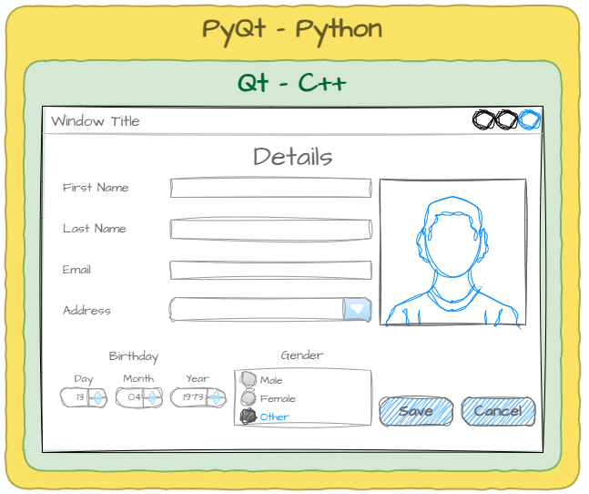

# Introduction

## What is PyQt?

**Qt** (cute) is a powerful tool that helps developers build **GUI** (Graphical User Interface) computer programs. Imagine making a custom app where you can click buttons, type into boxes, or drag and drop items - Qt makes all of that possible. It’s like a big box of LEGO, where each block is a tool to design parts of an app. Qt works on many devices, from computers and phones to special-purpose devices like ATMs or car dashboards.

The Qt library is written in C++ which provides low level access to computer hardware. Its flexibility and powerful features means that there is demand for using Qt with other languages. This demand has resulted in language wrappers for many popular languages, allowing developers to access and use the features of Qt.

```{admonition} Code wrappers
:class: tip
Code wrappers are like translators that let code written in one programming language talk to code written in another. They work by creating **bindings**, which are special connections that make functions or objects from one language available in another. For example, if you have a Python program and want it to use a library written in C, a wrapper acts as a bridge, using bindings to translate between Python and C so they can work together seamlessly. This allows developers to use the strengths of multiple languages in the same project.
```

**PyQt** (pie-cute) is a Python wrapper for Qt. It brings the power of Qt to your Python projects. This means that instead of using the more complex C++ language, PyQt lets you design the same kinds of apps using Python. With PyQt, you can create windows, buttons, menus, and even games!



## Tutorials and examples

This website has two parts, tutorials and examples. 

The **tutorials** will take you through the process of creating increasingly complex apps using PyQt. They will explore the thinking and habit involved in developing PyQt apps in preparation for developing your own apps.

The **examples** are basic applications which are designed to show you how a specific component works. Use these as a reference when developing your applications.

## MVC Architecture Pattern

The PyQt apps we create in these tutorials will use MVC Architecture. The MVC architecture pattern turns complex application development into a much more manageable process. It is example of modularization and decomposition.

MVC stands for model-view-controller. Here’s what each of those components mean:

- Model: The backend that contains all the data logic. Its job is to simply manage the data.
- View: The frontend or user interface (UI). Its job is to provide information to the user through graphics and sounds, and gather the user's input.
- Controller: The brains of the application that controls how data is displayed. Its job is to gather, modify, and provide data to the user. All data transferred between the model and the view must pass through the controller.


### Why use MVC?

We use MVC to establish separation of concerns(SoC).

The MVC pattern helps you break up the frontend and backend code into separate components. This way, it’s much easier to manage and make changes to either side without them interfering with each other. 

It is also easier to swap out components. If a developer wants to use a different UI, then they change the view component, same with the model.

### How we will use MVC in these tutorials

In these tutorials we will design the UI in **Qt Designer**. The resulting file will then be converted to the view file.

## PyQt Resources

Below are some excellent resources for working with PyQt

- **[Qt 6 Documentation](https://doc.qt.io/qt-6/)** PyQt methods and attributes mostly mirror the underlying Qt methods and attributes. So the official Qt 6 documentation is an excellent way of exploring all possibilities available to you. Its comprehensive, so I would suggest using the search box (you want to look at classes not QML Types).
- **[PyQt6 Documentation](https://www.riverbankcomputing.com/static/Docs/PyQt6/)** This is the official documentation for PyQt6. It is very dense, and aimed at a professional audience, but you might find useable information through a judicious use of the search bar.
- **[PythonGUIs](https://www.pythonguis.com/pyqt6-tutorial/)** provides some excellent tutorial on working with PyQt6.