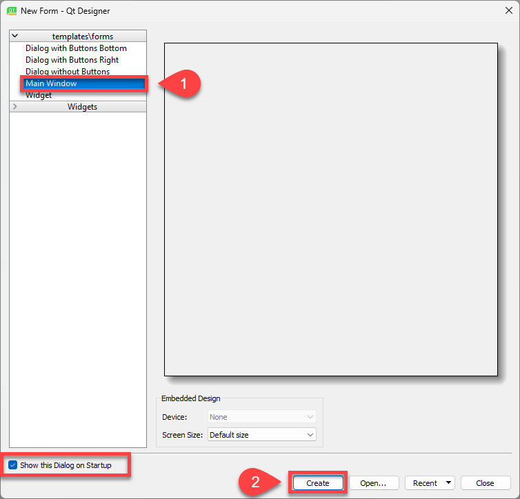
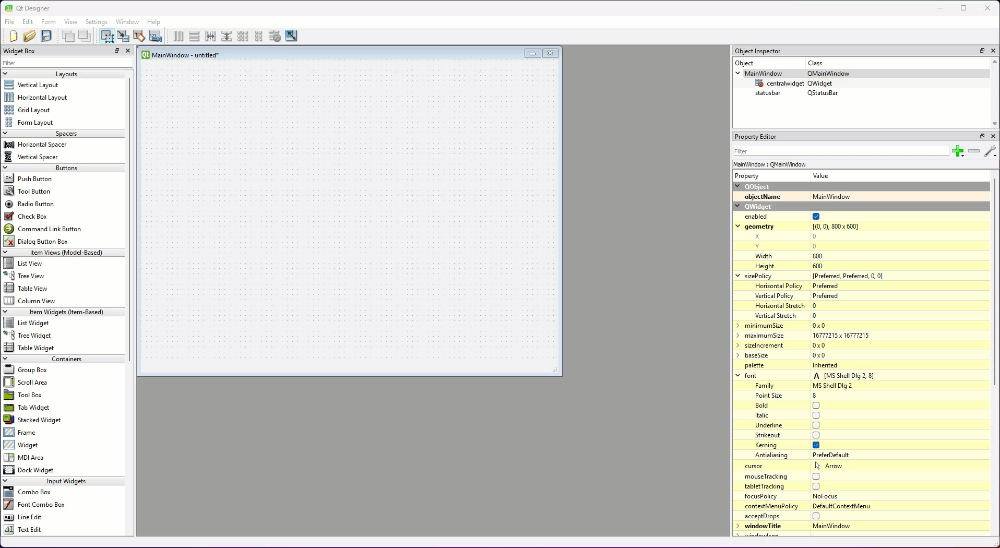

# Tutorial 1 - Creating Apps

```{admonition} In this lesson you will:
- Create a UI for a simple app in Qt Designer
- Add some formatted text to the UI
- Convert the UI to the view Python file
- Launch and test the app.
```

In this tutorial we will make a super simple app whose sole purpose is to learn our workflow. Throughout these tutorials we will design a UI in Qt Designer and then convert it to a Python file that we can use with the boilerplate code downloaded from the repo. This process will be the same irrespective of the complexity of the app.

## Meet Qt Designer

Qt Designer is a drag a drop UI creator. It is easy to underestimate how complex UIs can be. Just knowing the range of available components is a challenge. let along dealing with layout tools and resizing of windows. Having a visual representation of what your UI will look like makes life so much easier. So lets meet Qt Designer. Go ahead and launch it.

### New Form Dialogue

When Qt Designer first opens, it displays the New Form dialogue. This can be used to create different windows, as well as open previous UI files and access your recent designs.

To get started:

1. Make sure that **Main Window** is selected
2. Click the **Create** button



### Qt Designer Interface

Next your will see Qt Designer's interface.

These tutorials will only be using four parts of the interface:

1. **Widget Library** - this contains all of Qt's UI components.
2. **Window Canvas** - this is the window you're designing.
3. **Object Inspector** - shows all the components that make up the window. It also shows which components are nested inside other components.
4. **Property Editor** - this is where you can change the properties of the selected component.


We don't the **Resource Browser**, the **Action Editor** or the **Signal/Slot Editor** in the lower right corner. So feel free to close them if you want more screen real-estate.

```{admonition} A word on widets
:class: hint
Qt calls everything widgets. All windows are widgets. All textboxes are widgets. All layout components are widgets. These tutorials will use more specific terminology, but you will need to remember widgets if you look for information elsewhere.
```

---

## First App

Time to make your first app, a classic **Hello World!**.

### Adjust window

At the top is a of the screen there is a menu placeholder. This window won't have a menu, so we will remove that placeholder.

1. Right mouse click where is says **Type Here**
2. Click on **Remove Menu Bar**


Next we will change the geometry (size) of the window.

3. In the **Property Editor** change **width** to 400
4. Then change **height** to 300

```{admonition} Expanding **Property Editor**
:class: note
If your Property Editor looks different to the examples in these tutorials, you may need to expand sections. For example, if you can't see **width** and **height** you may need to expand the **geometry** section by clicking on the little arrow to the right of geometry.
```



Finally, we will change the title of the window.

5. In the **Property Editor** scroll down until you see **windowTitle**
6. Change the value from **MainWindow** to **Tutorial 1**


```{admonition} Naming conventions
:class: hint
We learnt in the introduction that Qt is written in C++. C++ uses the **camelCase** naming convention, as opposed to Python's **snake_case**. You will find that any variable, method or property will use camelCase, for example **windowTitle**.
```

### Add a label

Now we will add our label.

1. Scroll the **Widget Menu** down until you see the **Display Widgets**
2. Locate the **Label** widget onto the **Window Canvas**


The label needs to say something.

3. Double click on the label to edit it
4. Type **Hello World!**
5. Click on the **Window Canvas** away from the label to deselect it


That message is too hard to see.

6. Find **font** in the **Property Editor**
7. Change the **Point Size** to **20**
8. Grab the label's blue resize handles and resize the label so it can be read


### Save the UI file

Time to save the UI. It is important to save the UI file in the same directory (folder) as your **main_window.py**, ie. your repo for these tutorials.

1. Select **Save** from the **File** menu
2. Navigate to your repo for these tutorials
3. Name the file **tutorial_01.ui**

### Convert UI file

Now we need to convert the UI file to a Python file, and we will do this in VS Code.

If you don't have VS Code open from the setup.

1. Go to GitHub Desktop
2. Navigate to the repo for these tutorials
3. Choose **Open in Visual Studio Code**

Is everything ready?

4. Check that the **tutorial_01.ui** file is in your file panel.


Convert the file

5. Open a new terminal
6. At the prompt, type `pyuic6 -o ui_main_window.py -x tutorial_01.ui`
7. Then press enter

```{admonition} The convert command
:class: important
Let's break down that file converting command:
- `pyuic6` &rarr; the command that convert the file it stands for **py**thon **ui** file **c**onverter for PyQt**6**
- `-o ui_main_window.py` &rarr; designates the output file
- `-x tutorial_01.ui` &rarr; designates the source file
```


Time to run the app and check that it all works

8. Open the **main_window.py**
9. Run the code


## Conclusion

Congratulations, you just made your first PyQt apps. It may have been simple, but you learn some important processes that we will use over and over again during these tutorials.

Next tutorial we will build on these and learn more about the Label widget.