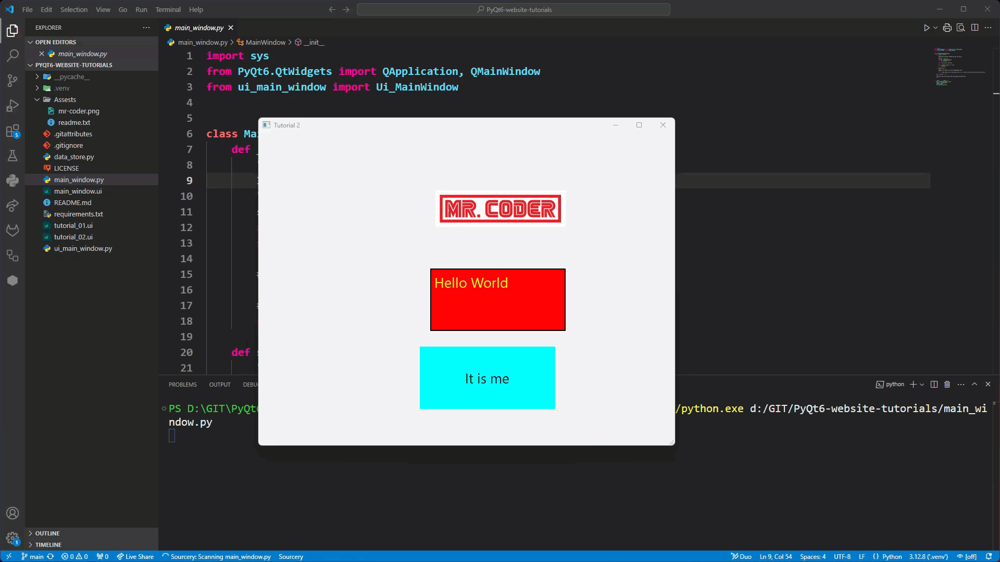
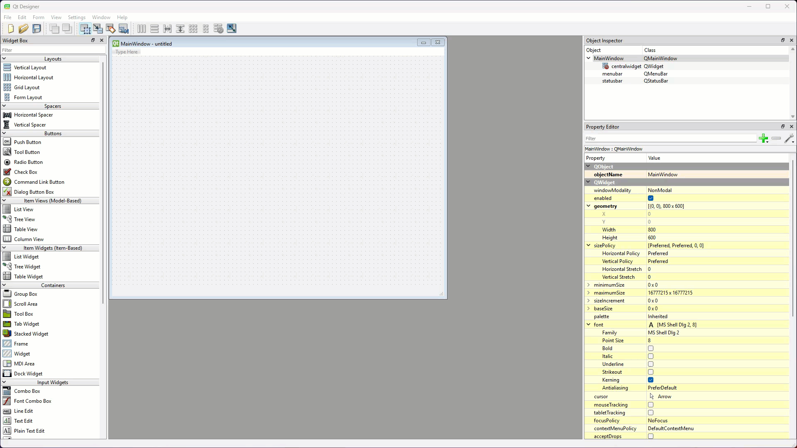
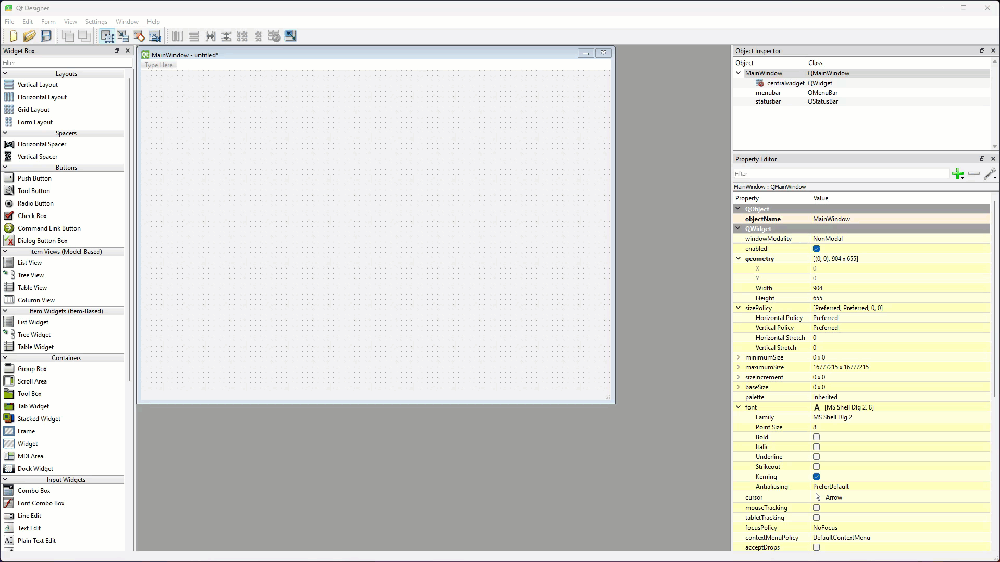
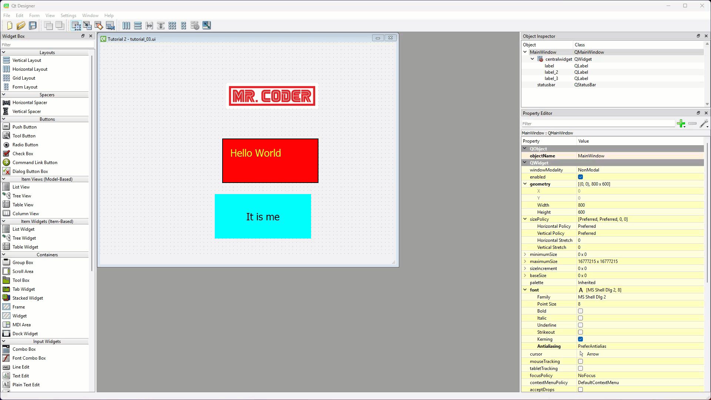
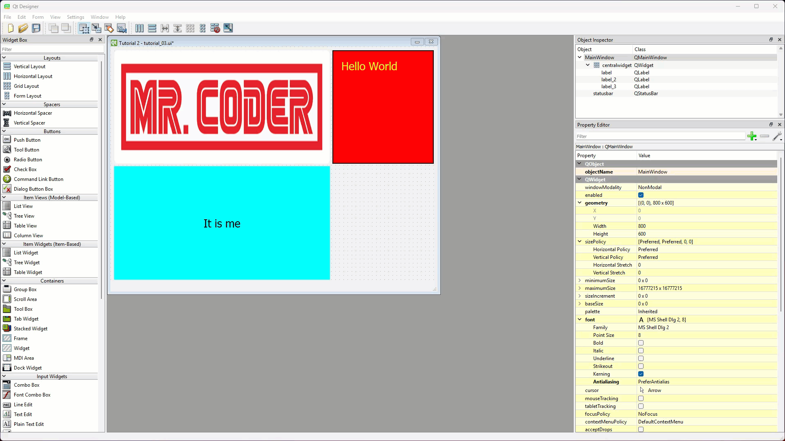

# Tutorial 3 - Layouts

```{admonition} In this tutorial you will:
- Learn about Qt's three Layouts
- Leanr about static and dynamic UIs
- Apply Layout to organise a window
```

## Static vs Dynamic UIs

Static UI's don't change in response to the size of the window. For example, if you launch the window we created in tutorial 2, you will notice that the labels do not respond to resizing of the window.



Notice how all three labels:

- remain the same distance from the top left corner (coordinate 0,0)
- remain the same size

A dynamic UI changes in response to the window size.

### Which to use?

**Static** can be used where the window does not need to change. The use for this is less than it first seems. Even when the window fill the screen, its size is dependant upon the resolution of the screen. Therefore, for most applications, **dynamic** UI are the best option.

## What are Qt Layouts?

**Qt layouts** are tools in the Qt framework that help organise how widgets appear in a window or application. Instead of manually setting the size and position of each widget, layouts automatically arrange them in a neat and logical way, even if the window is resized.

There are different types of layouts you can use in Qt:  

- Horizontal Layout  
- Vertical Layout
- Grid Layout
- **Form Layout** pairs labels with input fields, making forms easy to build.

Using layouts, and nesting layouts inside of other layouts, makes your applications look cleaner, more professional, and adaptable to different screen sizes without extra effort.

In this tutorial we will focus on the first three of these. Form layouts we will explore in a later tutorial.

## Applying Layouts in Qt Designer

In Qt Designer there are two ways to apply layouts to a window:

- right-click on a widget and then choose the layout
- drag-and-drop a layout from the Widget library

The best way to apply layouts is reliant upon which layout it is (initial  layout or subsequent layouts). The first layout is applied to the window, while subsequent layouts are nested inside this first layout.

### Initial Layout

If you drag-and-drop the initial layout, then it will not apply the resizing settings (see below).



But Qt Designer will not allow you to right-click either (the options are greyed out).



The trick is to have some widgets already in the window before you right-click and access the context menu.

### Subsequent Layouts

All subsequent layouts can use either method. I prefer the drag-and-drop method, so that is what we will use in these tutorials, but feel free to explore the right-click approach.

## Exploring Qt Layouts

To make this quicker, we will start with the UI from last tutorial.

1. Open **tutorial_2.ui** (you should find it in **File &rarr; Recent Forms**)
2. Save the file as **tutorial_3.ui** (**File &rarr; Save As...**)

Now lets look at the three different layouts.

### Horizontal Layout

The **Horizontal Layout** arranges widgets in a row of cells from left to right.

1. Right-click on the window
2. From the context menu choose **Layout &rarr; Lay Out Horizontally**



Note:

- Each cell's height is resized to fit the maximum height of the window.
- The entire row's size takes up the width of the window.
- The size of each cell is relative to the size of its content.

### Vertical Layout

The **Vertical Layout** stacks widgets one on top of another in a column of cells.

1. Undo the horizontal layout application
2. Right-click on the window
3. From the context menu choose **Layout &rarr; Lay Out Vertically**


Note:

- Each cell's width is resized to fit the maximum width of the window.
- The entire columns's size takes up the height of the window.
- The size of each cell is relative to the size of its content.

### Grid Layout

The **Grid Layout** places widgets in rows and columns, like a table.

1. Undo the vertical layout application
2. Right-click on the window
3. From the context menu choose **Layout &rarr; Lay Out in a Grid**


Note:

- Although it initially looks the same as the vertical layout, you can drag widgets to the sides and top or bottom of other widgets to make a table.
- Both the cell height and width are dependant upon the window size
- Cells in the same row, share the same height
- Cells in the same column, share the same width

### Adding subsequent widgets

Adding subsequent widgets simply involves dragging and dropping a widget from the widget library onto a cell in the layout. The widget will inherent the properties (eg. height and width) of that cell.



Note the red line or box that indicates where the widget will be placed.

## Nesting Layouts

Don't forget that layouts are also widgets. This means that a layout can be placed inside the cell of another layout. This is how you develop complex UIs, something that we will explore in later tutorials. This is also why it is important to plan out your UIs so you have a good idea of where all your layouts should go.

## Conclusion

Layouts are part of making good responsive UI and they are vital for complex UIs. This tutorials we have explored the three main window layouts.