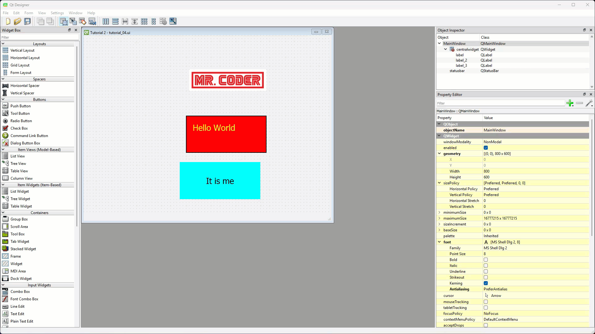
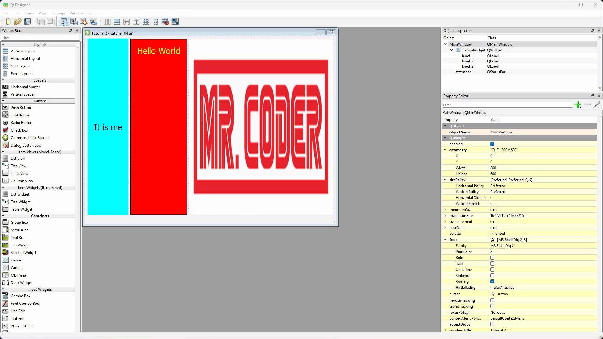
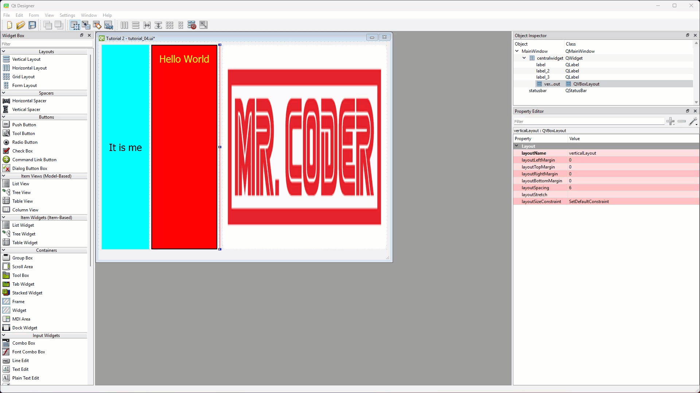
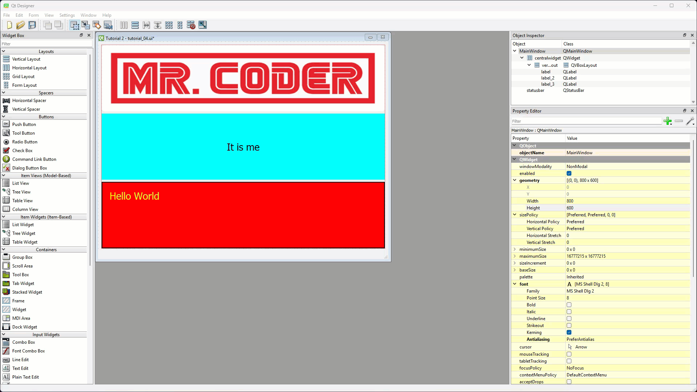
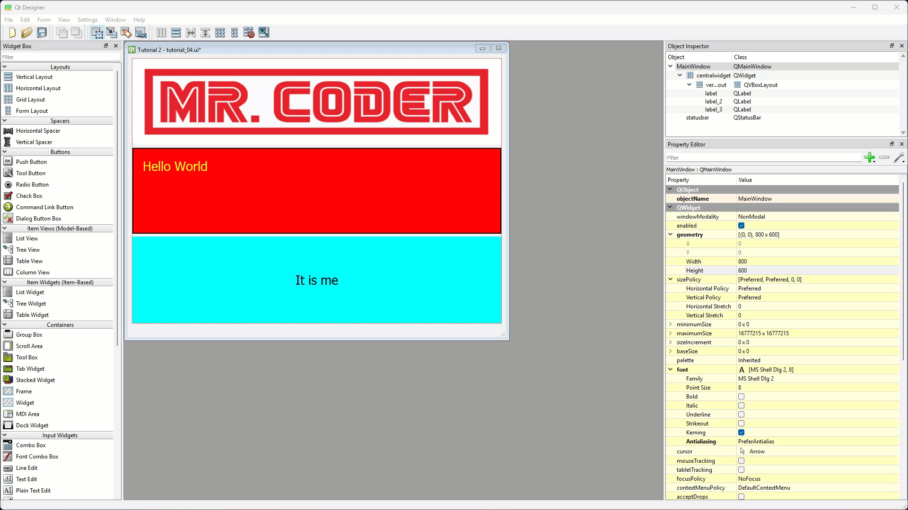

#  Tutorial 4 - Complex UIs

```{admonition} In this tutorial you will:
- Nest layouts to create a more complex UI
- Use spaces to control layout expansion
```

To make more complex UIs you need to nest layout and use spaces. We will explore these processes in this tutorial. We will create a UI with a horizontal layout for the main window, then place a vertical layout in the centre cell, which will then contain our widgets.The left and right cells will be empty. Finally we will look at how to use spaces to control the expansion of widgets in dynamic UIs.

## Nesting layouts

To create our nested layout UI, we need to start with a window that contains widgets.

1. Open **tutorial_2.ui** (you should find it in **File &rarr; Recent Forms**)
2. Change **windowTitle** to **Tutorial 4**
3. Save the file as **tutorial_4.ui** (**File &rarr; Save As...**)

### Add horizontal layout

The initial layout will be a horizontal layout.

1. Right click on the **window canvas**
2. From the context menu select **Layout &rarr; Lay Out Horizontally**



### Add vertical layout

Next we want to place a vertical layout into the middle of the horizontal layout.

1. From the **Widget Library** drag a **Vertical Layout** onto the **window canvas**
2. Position it either between, the first and second label, or the second and third label.



### Move labels

Now we want to move the three labels into the vertical layout. Normally we would click and drag them, but the vertical layout has been reduced to a line, so we can't do that. Fortunately we can also move things to the objects in the **Objects Inspector**.

1. Click and drag the first label to the QVBoxLayout in the **Object Inspector**
2. Repeat for the other two labels



Note in the **Object Inspector** the three labels are now indented under the QVBoxLabel.

### Arrange labels

With the labels inside the vertical layout, you can easily move them around by clicking and dragging. Look for the blue bar to see where widgets are being moved to.

1. Rearrange the labels to be in the following order



## Spacers

At the moment, the UI doesn't look that different to a simple UI with only a Vertical layout. But this nested setup allows us to use spacers to change the UI.

In Qt, **spacers** are special tools used to add empty space between widgets in a layout to control their positioning and alignment. Spacers act like "invisible springs" that push widgets apart, ensuring they are evenly spaced or aligned as you want.

There are two main types of spacers in Qt:

1. **Horizontal Spacers**: Add space between widgets arranged horizontally.  
2. **Vertical Spacers**: Add space between widgets stacked vertically.  

Spacers are especially useful when you want to create flexible layouts that adjust automatically when the window is resized. For example, you can use a spacer to push a button to the bottom of a window or to evenly spread out widgets. This helps your app look clean and organised across different screen sizes.

### Add horizontal spacers

We will add horizontal spacers to the left and the right of the vertical layout.

1. Click and drag a **Horizontal Space** from the **Widget library** to the left of the labels
2. Click and drag a **Horizontal Space** from the **Widget library** to the right of the labels



Note: the spacers compresses the centre cell to it's minimal size, then evenly split the remaining free space.

### Add vertical spacer

Now we will add just one space to the bottom of the horizontal layout.

1. Click and drag a **Vertical Space** from the **Widget library** to the bottom of the labels


Note: the spacer compresses the labels to their minimal size, and then shows the rest of the window as empty.

## Preview window

To preview the window, click **Form &rarr; Preview** or press **ctrl** / **cmd** + **P** keys.

Now resize the window, and you will notice that the labels remain at their smallest size, but remain in the middle top of the window.

Have a play with spacers. Move them around, add more, take some away. Preview the window and see what impact your changes have.

## Conclusion

In this tutorial we explored how to nest layouts, which will help us make complex UIs. We then learnt about spacers and ow they can be used to place gaps between widgets.