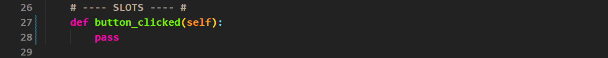
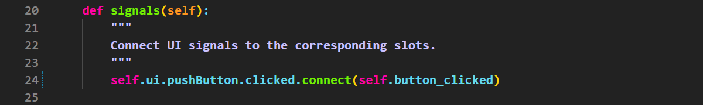

# Tutorial 5 - Signals and Slots

```{admonition} In this tutorial you will:
- add puchButtons to your UI
- use QT's signals and slots process architecture to create an interactive UI
```

So far out tutorials have been focusing on how to make an responsive UI.  While this is an important foundation, all we can do is display information. In this tutorial we will start learning about how to make out UI interactive and respond to the user.

## Push Buttons

The first input widget that we will explore is the **Push Button**. It simply registers when a user clicks on it. Push Buttons are probably the most common components in UIs.

### Tutorial file

Again we will use a previous UI file to introduce the Push Button.

1. Open **tutorial_4.ui** (you should find it in **File &rarr; Recent Forms**)
2. Change **windowTitle** to **Tutorial 5**
3. Save the file as **tutorial_5.ui** (**File &rarr; Save As...**)

### Add a Push Button

We want the Push Button to be on the right of the screen, so first we need to add a horizontal layout.

1. From the **Widgets Library**, click and drag a **Horizontal Layout**
2. Place it at the bottom of the **Vertical Layout** on the **window canvas**


We now need add the Push Button, but the Horizontal Layout is compressed. This means we will need to use the **Object Inspector**.

3. In the **Widgets Library** locate and click and drag the **Push Button**
4. Drag it over to the **Object Inspector** onto the **Horizontal Layout** we just added.


Notice the Push Button expands to fill the available space. We want use a Horizontal Spacer to compress it.

5. Grab a **Horizontal Spacer** from the **Widgets Library**
6. Drag it to the left of the **Push Button**


Finally we want to change the text on the Push Button

7. **Double-click** on the **Push Button** then type **Click Me**
8. Change the font **Point Size** to **12**


### Save the UI file

The UI is finished so time to save. Remember, it is important to save the UI file in the same directory (folder) as your **main_window.py**.

1. Select **Save** from the **File** menu

### Convert UI file

Now we need to convert the UI file to a Python file, and we will do this in VS Code.

1. Open VS Code via GitHub Desktop
2. Check that the **tutorial_05.ui** file is in your file panel.
3. Open a new terminal
4. At the prompt, type `pyuic6 -o ui_main_window.py -x tutorial_05.ui`
5. Then press enter.

Time to run the app and check that it all works

6. Open the **main_window.py**
7. Run the code.

Your UI should look the same as below. Notice that all the usual button behaviour is build it:

- highlights when you mouse over it
- changes colour to indicate a click

But it doesn't do anything. That's where the signals and slots come in.

## Signals and Slots

In Qt, **signals and slots** are a way for different parts of your program to communicate with each other, like sending messages when something happens. A **signal** is emitted (sent) when a specific event occurs, such as a button being clicked or a text field being edited. A **slot** is a function that gets called in response to that signal, allowing you to define what happens next. 

In Qt all widgets have signals. Over the course of these tutorials we will explore the most relevant signals for creating intermediate UI. If you want to explore more, then the best place to start is the **[Qt Documentation](https://doc.qt.io/qt-6/)**.

Both signals and slots have distinct places in the boilerplate code. Strictly speaking, they can go anywhere, but organising code in this way improve its maintainability.


We are going to establish some good programming habit right from the start.

Since signals call a method, it is best to at least create that method's name so your IDE can suggest it when you type.

```{admonition} Using suggested code
:class: hint
Using the code your IDE suggest can be helpful. It can speed up your coding, but more importantly it can minimise typo errors. Your IDE will suggest names that exist, therefore preventing you from calling incorrect variables and methods.
```

### Create slot

The first thing we will do is define a slot for our signal to call. It won't do anything. It is a place marker for code that we still need to right. We will use the Python **`pass`** statement to represent the missing code. It will also prevent your IDE from showing indentation errors due to a missing code block.

In **main_window.py**

1. Delete **lines 27 - 29**
2. Add the code below



### Connect signal

Now we need to connect the clicked signal to the slot. 

In **signals** method

1. Delete **line 24**
2. Add the code below



Lets take a second to understand what that line says.


- **Window name** - the name of our MainWindow that we defined in the `__init__`
- **Widget name** - the name of the widget whose signal will trigger the action.
- **Signal name** - the type of signal that will trigger the action.
- **Action** - the type of action that will be triggered (connect &rarr; run a slot method).
- **Target of action** - the slot method that will be run

### Complete slot

Finally we need to complete the slot. In response to the button being clicked we want to change the text of the label above it.

In the **button_clicked** method

1. Delete **line 28** &rarr; `pass`
2. Add the code below


In this code we are changing the **text** property of **label_2**.

```{admonition} Widget properties
:class: hint
With PyQt you can programatically change all widget properties. We will look at the most useful ones, but if you want to explore more check out the **[Qt Documentation](https://doc.qt.io/qt-6/)**.
```

### Testing

Save and run your code to check that it works.

```{admonition} Wrong label
:class: error
If the wrong label changes when you click the button:

1. open your **UI file** in **QT Designer**
2. click on the label you want to change
3. check the label name in the **Property Editor**


4. then in **main_window.py** change the name in your code accordingly
```

## Conclusion

In this tutorial we learnt how to add **Push Buttons**, as well as furthered our understanding of nested layouts. We then learnt about Qt's interactivity mechanism, **signals and slots**. We connected a **signal** from the **Push Button** to a **slot** that change the text of a label.
