# Tutorial 6 - Calculator App

```{admonition} In this tutorial you will:
- apply learnt techiques to develop a calculator app
- use QT Styles to change the appearance of your app
- develop the application logic inside the control file
```

Now that we have learn rudimentary input and output widgets, we can develop a calculator application. This is a great starting project since calculators only consist of displays and buttons, and we know how to implement these in PyQt.

## Create UI

To start this project we will create the UI file. Launch Qt Designer and create a new **Main Window**.

### Format the Main Window

For the **Main Window**:

1. Remove the **menu bar**
2. Remove the **status bar**
3. In the **Properties Editor**, change the **geometry** to:
   - **width** &rarr; **400**
   - **height** &rarr; **500**
4. Change the **windowTitle** to **Calculator**

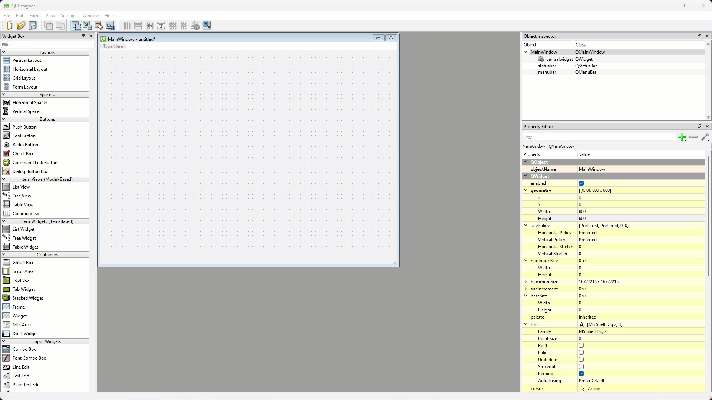

### Display label

Now we will add the display label:

1. In the **Widgets Toolbox** find the **Label** widget
2. Click and drag it onto the **window canvas**
3. Then right-click the **window canvas**, choose **Layout** the **Lay Out Vertically**

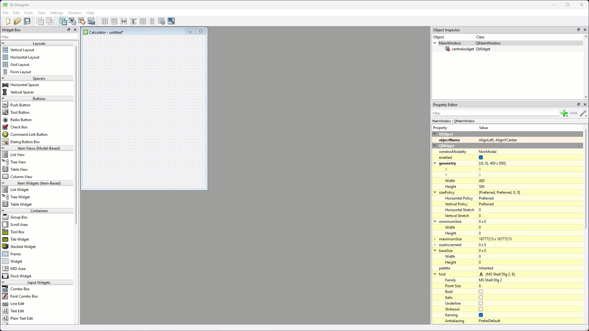

In this tutorial we will rename all the widgets so it easier to refer to them in our code:

4. At the top of the **Properties Editor**, find **objectName**
5. Change it to **label_display**

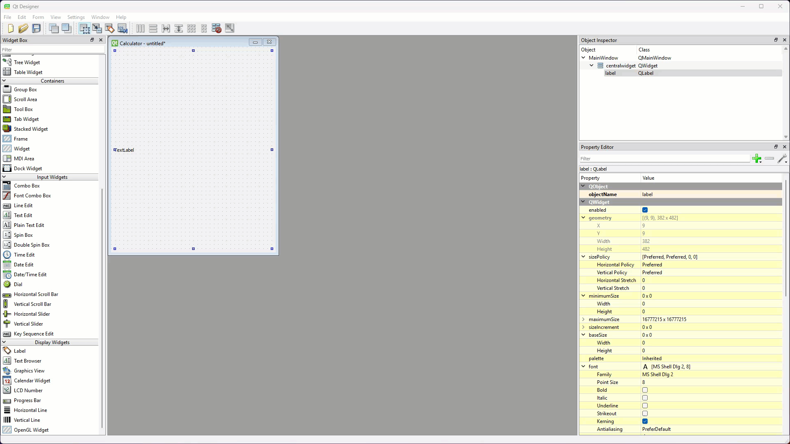

```{admonition} Widget Names
:class: hint
All but the simplest of UIs will contain numerous widgets, so it is important to keep track of them. Here are some suggested conventions to help with naming them:


- only name widgets that your code will interact with:
  - this mean you program will either get input from the widget or use it to provide output
  - ie. if a label never changes, there is no need to name it
- use prefixes to denote the type of widget:
  - in your Python code you will not know if you are referring to a label or a button, so it is important to include a description in the name
  - for the purposes of these tutorials, we will just use Qt Designers name as out prefix (in this case **label**)
  - you may choose your own naming convention (eg. lbl for labels), just remember to be consistent
  ```

Finally we will format **label_display**:

6. Change the **font** to:
   - **Family** &rarr; **Consolas** (macOS might need to use **SF Mono**)
   - **Point Size** &rarr; **40**
7. Change the **Horizontal** **alignment** &rarr; **AlignRight**

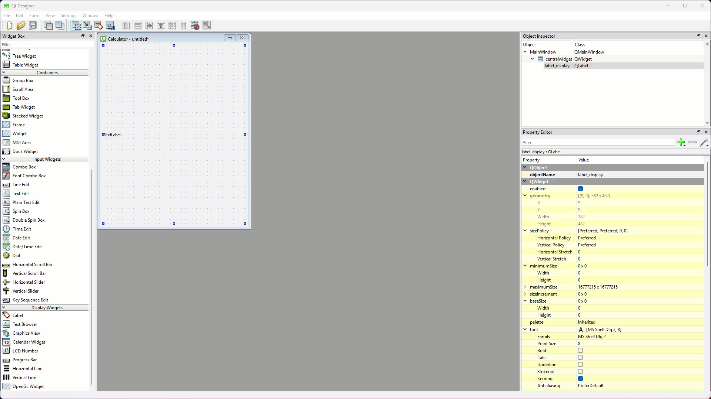

### Buttons

Now we have to add the buttons to our calculator. To save time, we will add one button and format it. Then we will copy it for the other buttons, which will also copy the formatting.

First we need to add a grid layout below the label:

1. Locate the **Grid Layout** in the **widget library**
2. Drag and drop it onto the **window canvas** under **label_display**


Now to add and format the first button.

3. Find the **Push Button** widget in the **widget library**.
4. Drag and drop it into the red box defining the **Grid Layout**
5. Rename the **Push Button** to **pushButton_7**
6. Change its **sizePolicy**:
   - **Horizontal Policy** &rarr; **MinimumExpanding**
   - **Horizontal Policy** &rarr; **MinimumExpanding**
7. Change the font
   - **Family** &rarr; **Consolas** (macOS might need to use **SF Mono**)
   - **Point Size** &rarr; **20**
8. Change the text &rarr; **7**

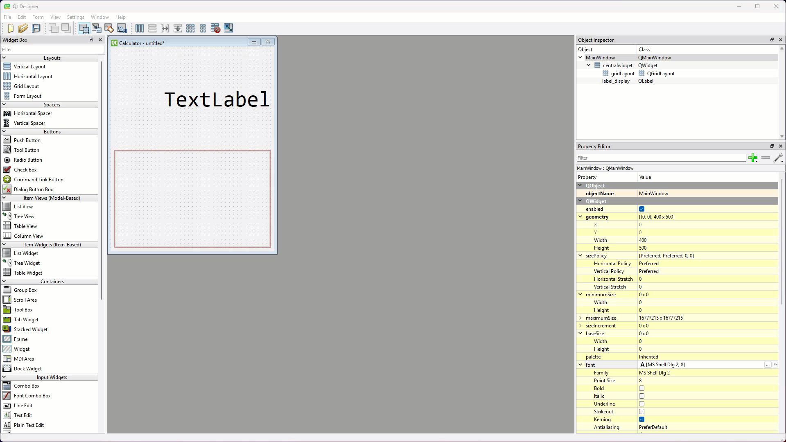

```{admonition} Size Policy
:class: hint
In Qt, the **sizePolicy** determines how a widget behaves when a layout tries to resize it. It controls whether the widget can expand, shrink, or stay fixed in both the horizontal and vertical directions. A widget's size policy is made up of two parts: **horizontal policy** and **vertical policy**.

**Size Policy options**

| Policy | Behaviour |
| :--- | :--- |
| Fixed | Stays the same size. No shrinking or expanding. |
| Minimum | Shrinks to minimum size but doesn’t grow. |
| Maximum | Grows as much as possible but doesn’t shrink. |
| Preferred | Prefers size hint but can shrink or expand. |
| Expanding | Shrinks or grows to use all available space. |
| MinimumExpanding | Doesn’t shrink below minimum size but expands if needed. |
| Ignored | Ignores size hint and resizes freely. |
```

Since we have finished setting the button's properties, we can copy it.

9. Ctrl / Cmd click and drag pushButton_7 to copy it
10. Place the new button to the right of pushButton_7
11. Make sure the name is **pushButton_8**
12. Change the button text &rarr; **8**

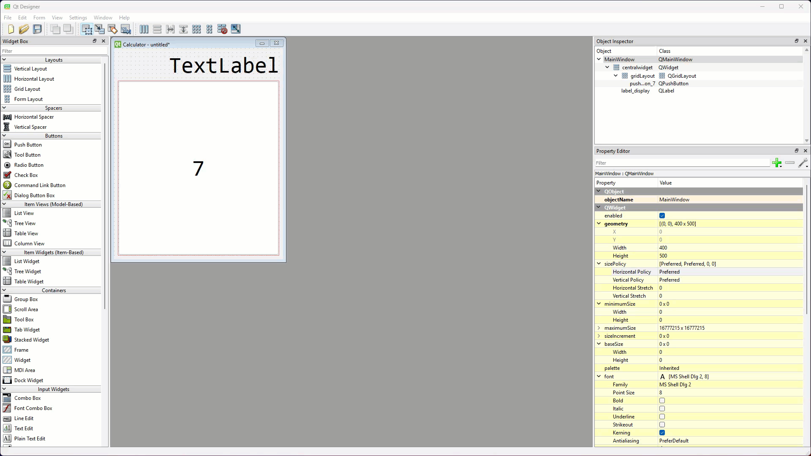

Copy the rest of the buttons so your UI looks like the one below.

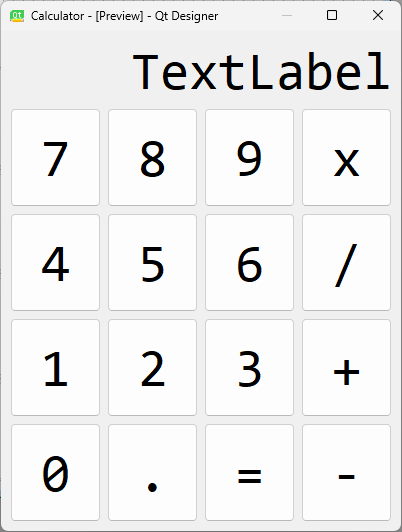

#### Button names

Below are name names given to the pushButton widgets.

```{admonition} Special characters in names
:class: warning
In Python, operators (**`*`**, **`/`**, **`+`**, **`-`** and **`=`**) cannot be used in names, so you will have to spell out the word in the button names (eg. the **x** button should be named **pushButton_multiply**).
```

| First Column | Second Column | Third Column | Forth Column |
| :--- | :--- | :--- | :--- |
| pushButton_7 | pushButton_8 | pushButton_9 | pushButton_multiply |
| pushButton_4 | pushButton_5 | pushButton_6 | pushButton_divide |
| pushButton_1 | pushButton_2 | pushButton_3 | pushButton_add |
| pushButton_0 | pushButton_decimal | pushButton_equal | pushButton_subtract |

### Final touch

Our UI almost looks like a calculator. The last thing we will do is change the **label_display** widget's text to `0`.

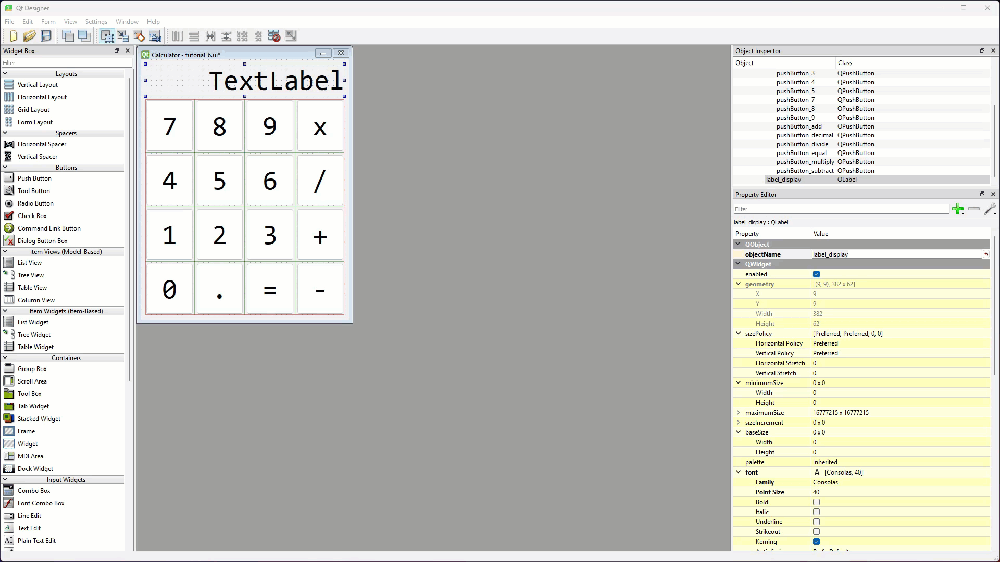

Now it actually looks like a calculator.

### Save the UI file

The UI is finished so time to save. Remember, it is important to save the UI file in the same directory (folder) as your **main_window.py**.

1. Select **Save** from the **File** menu
2. Call the file **tutorial_06.ui**

### Convert UI file

Now we need to convert the UI file to a Python file, and we will do this in VS Code, but we are going to do something different. We will give our Python UI file a unique name, one that we won't write over in latter tutorials.

1. Open VS Code via GitHub Desktop
2. Check that the **tutorial_06.ui** file is in your file panel.
3. Open a new terminal
4. At the prompt, type `pyuic6 -o ui_calculator.py -x tutorial_06.ui`
5. Then press enter.

## Write the code

Now it is time to work on the controller.

### Copy main_window.py

We want to give our controller file a meaningful name:

1. Copy **main_window.py**
2. Rename the copied file **calculator.py**
3. Run the code to test the results.

You should see the UI below, which is the wrong UI.

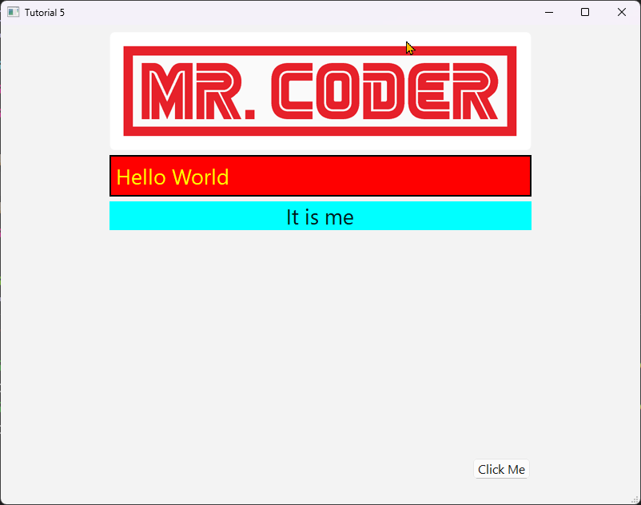

The reason for this is **calculator.py** is still looking for its UI in the **main_window.py** file.

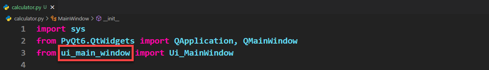

To fix this:

4. change **line 3** to the same as below

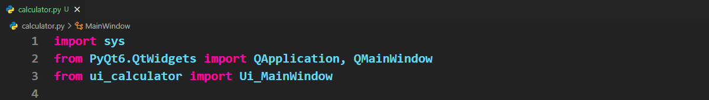

5. Run the code again to test.

You should now have your calculator UI.

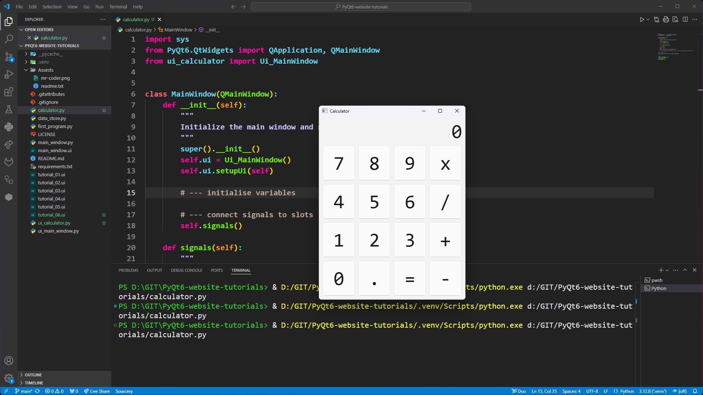

### Python's eval method

Now that we know that our UI works, we need to discuss how our controller will work. We will leverage an awesome Python built-in function called **eval()**. It takes a string which is a mathematical equation, and calculates the results. For example, the line `print(eval("3+2"))` will print `5`.

This means that we can gradually build an equation string in response to the button clicks, and the use `eval()` to work out the answer when **pushButton_equal** is clicked. It will get a little bit more complicated, but this is a good starting point.

```{admonition} String methods
:class: hint
Strings are super important in Python programming, so it pays to know all the ways you can manipulate them. **[w3schools' Python String Methods page](https://www.w3schools.com/python/python_ref_string.asp)** shows you all the built-in methods available in the Python Standard Library.
```

### Create equation variable

To achieve this we will need to variable to store our equation string as we build it. The `__init__` in our boilerplate code has section for variables, so lets put it in there.

1. Open **calculator.py**
2. Go to **`__init__`**
3. Add the code in **line 16**

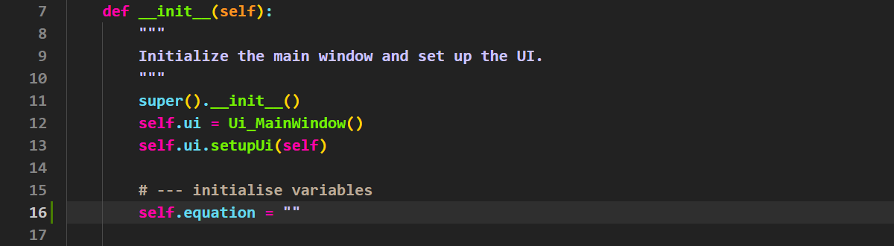

```{admonition} Code explaination
:class: seealso
**`self.equation = ""`** simply creates an empty string variable. We will add charactes to this variable as the user clicks on buttons
```

### Handle signals and slots

We are now at the point of coding our signals and slots, so we're going to follow the same process we used in the last tutorial.

```{admonition} Handling signals and slots
:class: hint
Our three step process for handling slots and signals in PyQt:

1. Create slot placeholder
2. Connect signal to the slot
3. Complete the logic of the slot
```

The slot logic for all buttons, except the equal button, will involve adding the appropriate character to the `self.equation` string. Let's see how to do this for the **9 button**

First we create the slot placeholder

1. In **calculator.py** find the **slots** section.
2. Add the code from **lines 31 and 32** below.

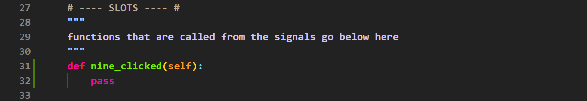

```{admonition} Code explaination
:class: seealso
The place holder will help with your IDE autocomplete.
```

3. Navigate up to the **signals** method
4. Replace **line 25** with the **line 25** below.

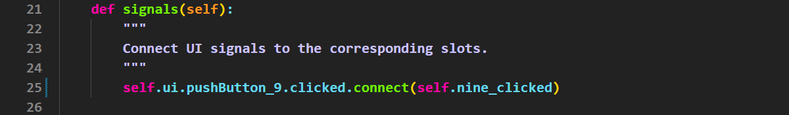

```{admonition} Code explaination
:class: seealso
This code connects the **pushButton_9** click signal to our **nine_clicked** method
```

6. Now return to the **nine_clicked** method,
7. replace the **pass** with the code in **line 32** below.

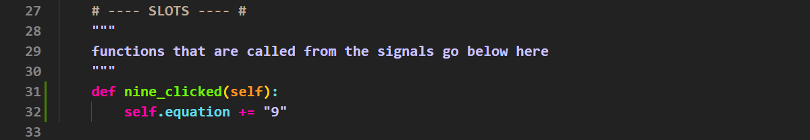

```{admonition} Code explaination
:class: seealso
When the nine button is clicked, the `9` character will be added to the end of the `self.equation` string.
```

Time to test.

8. Launch your app.
9. Click on the 9 button.

```{admonition} No UI response
:class: error
When you click the 9, nothing will happen with the UI. Why? Well, we haven't updated the display to show the new value of `self.equation`
```

### Update the display

Since we will need to update the display after every button click, we will make a separate function to call from each button slot.

1. Under the **nine_clicked** method, make a new section for `# ---- OTHER FUNCTIONS ---- #`
2. Then add the code below from **lines 35 and 36** 

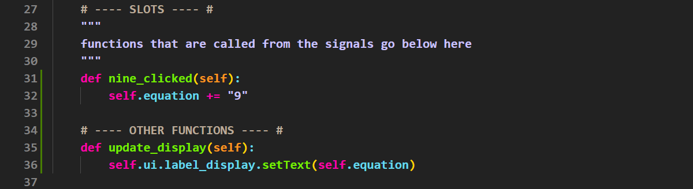

```{admonition} Code explaination
:class: seealso
This code will change the text value of the label_display to the current value of `self.equation`
```

3. Now from your **nine_clicked** method, call your **update_display** method.
4. Add **line 33** from below

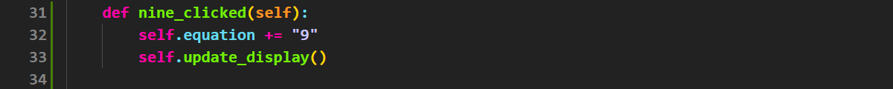

Time to test again.

Clicking the 9 button should now change the display, like below.

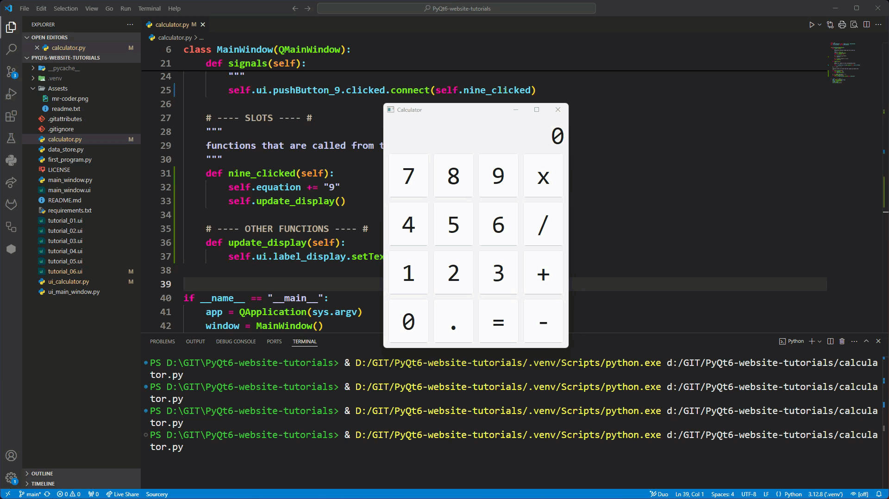

### The other buttons

You need to repeat the process for every other button, except the **equal button**.

Remember:

- follow our three step process for handling slots and signals
- call **update_display** at the end of each of your slots
- test your code each time you finish with a button.

## Conclusion

In this tutorial we started creating a calculator app. We created a more complex UI using nested layout widgets. We then created the code to handle the signals from all but one of our buttons. By the end of the tutorial, your UI should work like the example below.

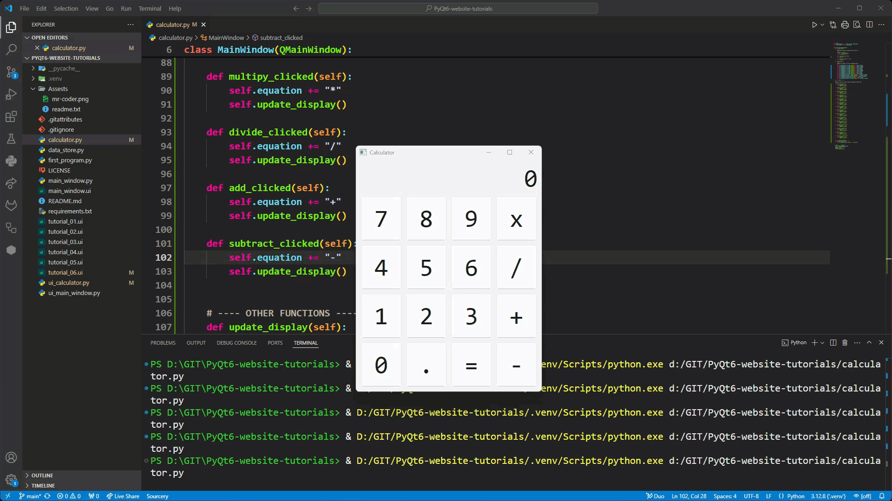
