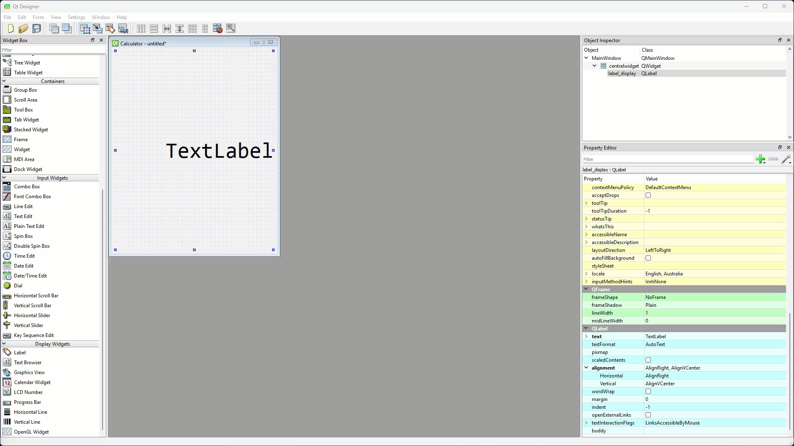

# Tutorial 6 - Calculator App

```{admonition} In this tutorial you will:
- apply learnt techiques to develop a calculator app
- use QT Styles to change the appearance of your app
- develop the application logic inside the control file
```

Now that we have learn rudimentary input and output widgets, we can develop a calculator application. This is a great starting project since calculators only consist of displays and buttons, and we know how to implement these in PyQt.

## Create UI

To start this project we will create the UI file. Launch Qt Designer and create a new **Main Window**.

### Format the Main Window

For the **Main Window**:

1. Remove the **menu bar**
2. Remove the **status bar**
3. In the **Properties Editor**, change the **geometry** to:
   - **width** &rarr; **400**
   - **height** &rarr; **500**
4. Change the **windowTitle** to **Calculator**


### Display label

Now we will add the display label:

1. In the **Widgets Toolbox** find the **Label** widget
2. Click and drag it onto the **window canvas**
3. Then right-click the **window canvas**, choose **Layout** the **Lay Out Vertically**


In this tutorial we will rename all the widgets so it easier to refer to them in our code:

4. At the top of the **Properties Editor**, find **objectName**
5. Change it to **label_display**


```{admonition} Widget Names
:class: hint
All but the simplest of UIs will contain numerous widgets, so it is important to keep track of them. Here are some suggested conventions to help with naming them:


- only name widgets that your code will interact with:
  - this mean you program will either get input from the widget or use it to provide output
  - ie. if a label never changes, there is no need to name it
- use prefixes to denote the type of widget:
  - in your Python code you will not know if you are referring to a label or a button, so it is important to include a description in the name
  - for the purposes of these tutorials, we will just use Qt Designers name as out prefix (in this case **label**)
  - you may choose your own naming convention (eg. lbl for labels), just remember to be consistent
  ```

Finally we will format **label_display**:

6. Change the **font** to:
   - **Family** &rarr; **Consolas** (macOS might need to use **SF Mono**)
   - **Point Size** &rarr; **40**
7. Change the **Horizontal** **alignment** &rarr; **AlignRight**


### Buttons

Now we have to add the buttons to our calculator. To save time, we will add one button and format it. Then we will copy it for the other buttons, which will also copy the formatting.

First we need to add a grid layout below the label:

1. Locate the **Grid Layout** in the **widget library**
2. Drag and drop it onto the **window canvas** under **label_display**



Now to add and format the first button.

3. Find the **Push Button** widget in the **widget library**.
4. Drag and drop it into the red box defining the **Grid Layout**
5. Rename the **Push Button** to **pushButton_7**
6. Change its **sizePolicy**:
   - **Horizontal Policy** &rarr; **MinimumExpanding**
   - **Horizontal Policy** &rarr; **MinimumExpanding**
7. Change the font
   - **Family** &rarr; **Consolas** (macOS might need to use **SF Mono**)
   - **Point Size** &rarr; **20**
8. Change the text &rarr; **7**


```{admonition} Size Policy
:class: hint
In Qt, the **sizePolicy** of a widget determines how it behaves when a layout tries to resize it. It controls whether the widget can expand, shrink, or stay fixed in both the horizontal and vertical directions. A widget's size policy is made up of two parts: **horizontal policy** and **vertical policy**.

**Size Policy options**

| Policy | Behaviour |
| :--- | :--- |
| Fixed | Stays the same size. No shrinking or expanding. |
| Minimum | Shrinks to minimum size but doesn’t grow. |
| Maximum | Grows as much as possible but doesn’t shrink. |
| Preferred | Prefers size hint but can shrink or expand. |
| Expanding | Shrinks or grows to use all available space. |
| MinimumExpanding | Doesn’t shrink below minimum size but expands if needed. |
| Ignored | Ignores size hint and resizes freely. |
```

Since we have finished setting the button's properties, we can copy it.

9. Ctrl / Cmd click and drag pushButton_7 to copy it
10. Place the new button to the right of pushButton_7
11. Make sure the name is **pushButton_8**
12. Change the button text &rarr; **8**


Copy the rest of the buttons so your UI looks like the one below.

