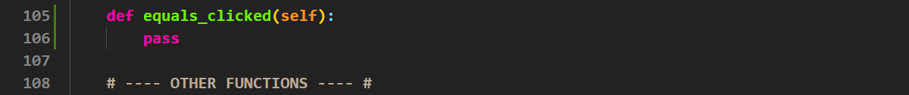
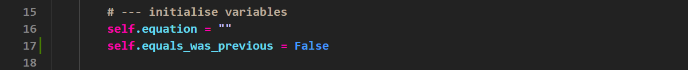
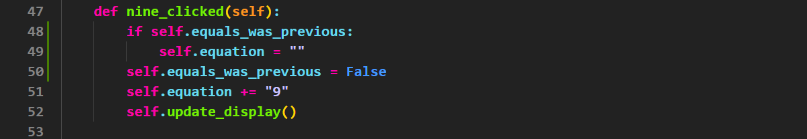

# Tutorial 7 - Refine Calculator App

```{admonition} In this tutorial you will:
- make the calculator app perform calculations
```

In the previous tutorial we created a calculator UI. Now it is time to make it work.

## Equals button

We mention in the previous tutorial that we will use Python's **eval()** function to calculate the value of the string equation that our calculator has created. We also did not assign a signal and slot to the equal button. Well it is time address both of these.

### Equals signals and slots

Just like all the other buttons, first we will create the equals_clicked slot.

1. Go to the bottom of your slots section
2. Add the code on **line 105** and **line 106** below.



Now we need to add the signal.

3. Go to the bottom of the **signals** method.
4. Add the code on **line 40**.


Finally complete the equals slot.

5. Return to the **equals_clicked** slot
6. Replace the `pass` with the code from **lines 107 to 109** below.


### Testing Equals

Time to run your program and see if it works. At the moment it is very rudimentary, but it will work with simple calculations. So run your calculator and trying a simple equation.

It won't take you long to see that there are many problems with our simple calculator. The rest of this tutorial is about fixing those problems.

## After Clicking Equals

After we click the equals button, the calculator returns the result of the calculation. That is good. The problem occurs when we click the next button. It's value gets added to the calculation result on the screen.

- If that button is an operator (+, -, / or *) then this is normal operation of a calculator, and that's ok.
- If that button is a number, then that is not how a calculator works. A normal calculator removes the result and starts a new calculation.

How are we going to solve this?

The problem is that the calculator needs to know whether the previous button click was the **equals** button, that way it know how to respond to our number clicks. To record if the equals button has been clicked, we will use a flag variable.

```{admonition} Flag Variables
:class: hint
A **flag variable** is a boolean used to indicate when a specific condition has been met in a program. It is typically set to `True` when an event occurs and reset to `False` when the condition is no longer valid. Flag variables are commonly used in loops, decision-making, and event handling to control program flow efficiently.
```

### Create Flag Variable

The first step is creating the flag variable, we need to do this in `__init__`.

1. Go to the **initialise variables** section of the `__init__` method
2. Add the line of code in **line 17 below**



```{admonition} Naming Flag Variables
:class: hint
When naming flag variables, it is best to name them as a statement, so their value of `True` or `False` makes sense.
```

### Set Flag Variable

Now we need to set the flag variable. We want to set it to `True` when the **equal** button is pressed, but reset it to `False` if any other button is pressed.

First lets focus on setting the flag to `True`.

1. Go to the **equals_clicked** slot
2. Add the code in **line 108** below


Now to work on when the flag gets set to `False`, which is every other button. Lets start on **button 9**.

3. Go to the **nine_clicked** slot
4. Add the code in **line 48** below.


Now **repeat this for all the other buttons**, except the equals button.

### Use Flag Variable

Now that the flag variable is set for each button, time to use it to influence the behaviour of our calculator app.

What we want to do is for each of the **number buttons and the decimal button**:

- check if the previous button was equals
- if it was, reset `self.equation` to `""` before appending the number to it.

Again we will start with **button 9**

1. Go to the **nine_clicked** slot
2. At the top (this is important) of the method add the code in **line 48** and **line 49**.



Again repeat this for all the other numbers and the decimal button.

### Testing Flag

Time to test that the flag works. Launch your app and check what happens after you click the equals button.
