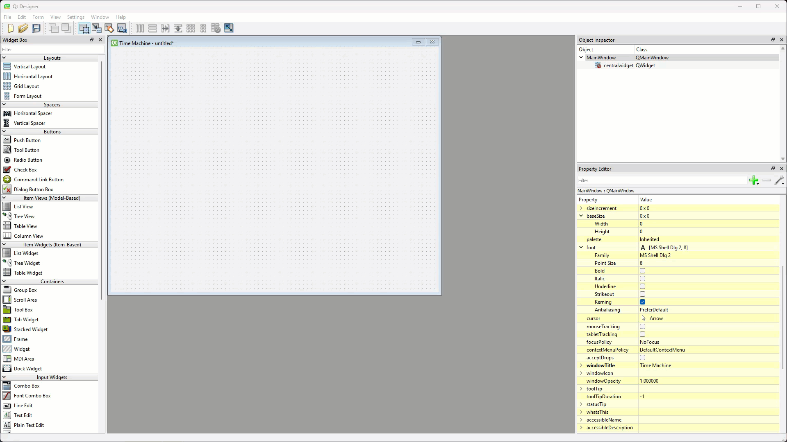
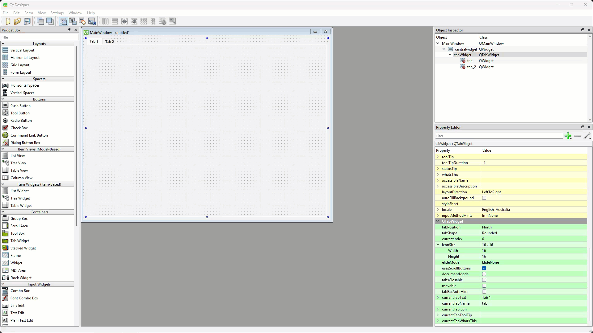
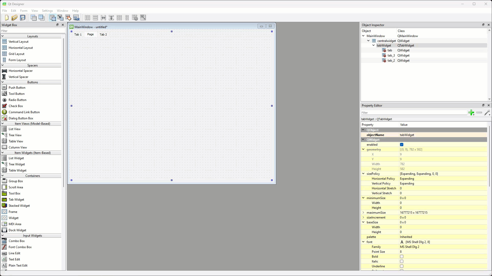
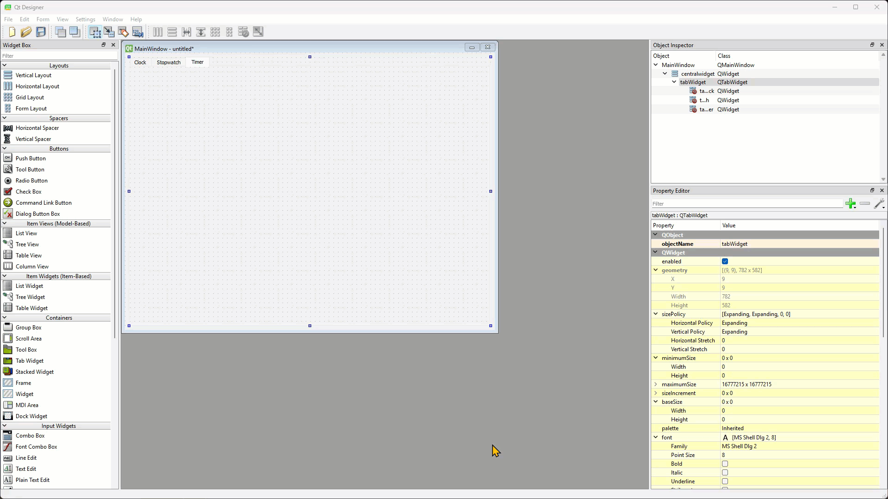
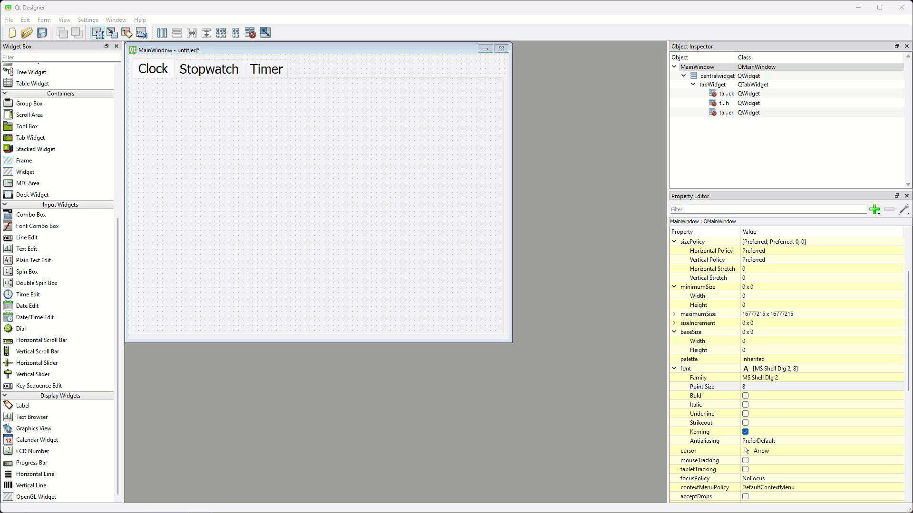
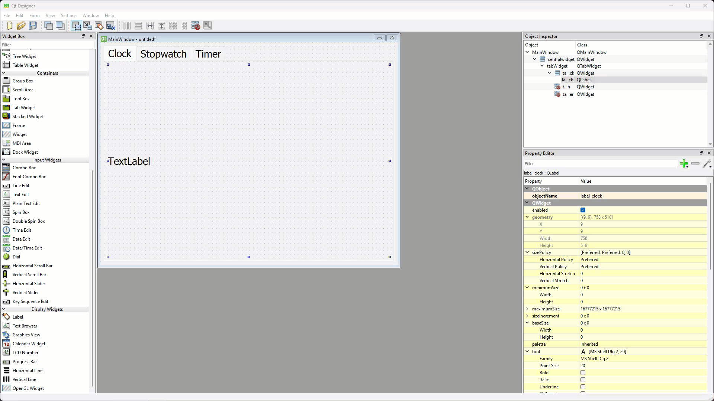
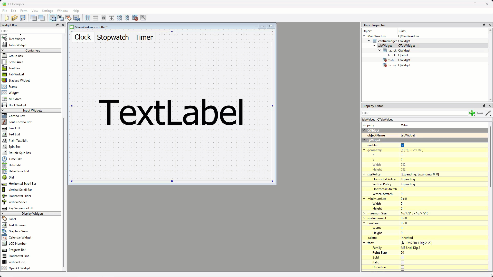
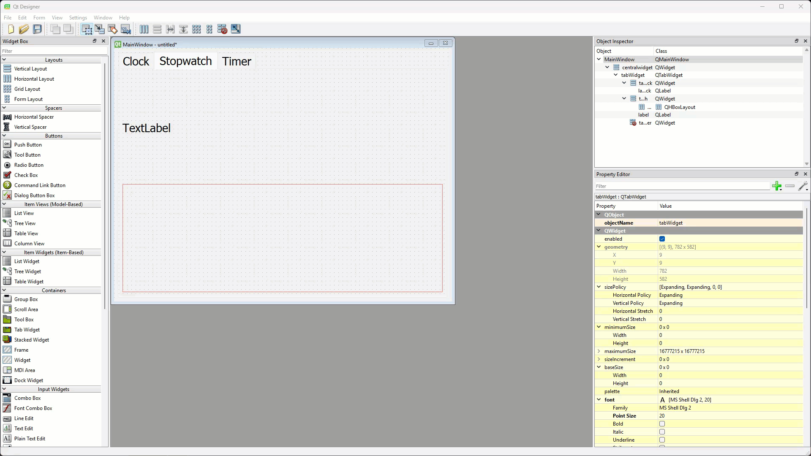
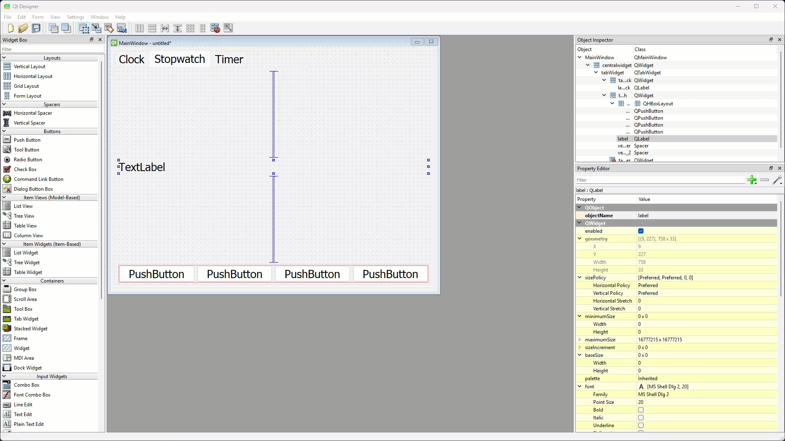

# Tutorial 8 - Create Timer App

```{admonition} In this tutorial you will:
- stuff
```

To introduce more QT features we are going to make a new app, a clock/stopwatch/timer app.

## Create UI

To start this project we will create the UI file. Launch Qt Designer and create a new **Main Window**.

### Format the Main Window

For the **Main Window**:

1. Remove the **menu bar**
2. Remove the **status bar**
3. In the **Properties Editor**, change the **geometry** to:
   - **width** &rarr; **800**
   - **height** &rarr; **600**
4. Change the **windowTitle** to **Time Machine**


### Add the Tab Widget

The **tab widget** is a container widget which is used to create multi-page UIs navigated using tabs.

```{admonition} Container Widgets
:class: hint
Qt **Container Widgets** are special widgets that hold and organize other widgets inside them. They help structure a GUI by grouping buttons, labels, and other elements neatly.

Common Container Widgets:

1. **[QWidget](https://doc.qt.io/qt-6/qwidget.html)** – The basic container for any widgets.
2. **[QGroupBox](https://doc.qt.io/qt-6/qgroupbox.html)** – A box with a title, used to group related widgets.
3. **[QFrame](https://doc.qt.io/qt-6/qframe.html)** – A simple container with a border.
4. **[QTabWidget](https://doc.qt.io/qt-6/qtabwidget.html)** – Creates a tabbed interface.
5. **[QStackedWidget](https://doc.qt.io/qt-6/qstackedwidget.html)** – Lets you switch between different screens (like pages).
6. **[QScrollArea](https://doc.qt.io/qt-6/qscrollarea.html)** – Adds scrollbars when content is too big.
7. **[QSplitter](https://doc.qt.io/qt-6/qsplitter.html)** – Allows resizing of sections by dragging.
```

1. In the **Containers** section of the **Widgets Toolbox** find the **Tab Widget**.
2. Click and drag it onto the **window canvas**
3. Then right-click the **window canvas**, choose **Layout** then **Lay Out Vertically**



### Organise the tabs

We will three tabs - **Time**, **Stopwatch** and **Timer**, so we need to add a tab.

1. Go to the **Object Inspector**
2. Right-click on the **tabWidget**
3. Choose **Insert Page** &rarr; **After Current Page**



Now we need to name the tabs

4. Click on the **left tab**
5. The the **Property Editor** scroll down to the QTabWidget section
6. Change **currentTabText** &rarr; **Clock**
7. Change **currentTabName** &rarr; **tab_clock**
8. Click on the **centre tab**
9. Change **currentTabText** &rarr; **Stopwatch**
10. Change **currentTabName** &rarr; **tab_stopwatch**
11. Click on the **right tab**
12. Change **currentTabText** &rarr; **Timer**
13. Change **currentTabName** &rarr; **tab_timer**



To make the tabs easier to read, resize the font

14. Click on the **Clock** tab and change the **font Point Size** to **20**



### Populate the Clock tab

Now to add the required elements onto the Clock tab.

1. Click on the **Clock** tab
2. Drag the **Label Widget** from the **Widgets Toolbox** to the **windows canvas**
3. Then right-click the **window canvas**, choose **Layout** then **Lay Out Vertically**
4. At the top of the **Properties Editor**, find **objectName**
5. Change it to **label_clock**



Now to format the **clock_label**

6. Change the **font Point Size** to 100
7. Then scroll down and find **alignment Horizontal** and change it to **AlignHCenter**



### Populate the Stopwatch tab

On to adding elements to the Stopwatch tab.

1. Click on the **Stopwatch** tab
2. Drag the **Label Widget** from the **Widgets Toolbox** to the top half of the **windows canvas**
3. Locate and drag the **Horizontal Layout** to the bottom half of the **windows canvas**
4. Then right-click the **window canvas**, choose **Layout** then **Lay Out Vertically**



5. Drag four **Push Buttons** into the **Horizontal Layout**
6. Drag a **Vertical Space** above and below the **Label**



7. Change the Label name &rarr; **label_stopwatch**
8. Change the first Push Button name &rarr; **pushButton_sw_start**
9. Change the first Push Button text &rarr; **Start**
10. Change the second Push Button name to &rarr; **pushButton_sw_pause**
11. Change the second Push Button text &rarr; **Pause**
12. Change the third Push Button name to &rarr; **pushButton_sw_stop**
13. Change the third Push Button text &rarr; **Stop**
14. Change the forth Push Button name to &rarr; **pushButton_sw_reset**
15. Change the forth Push Button text &rarr; **Reset**
 


16. Change the **label_stopwatch font Point Size** &rarr; 100
17. Then scroll down and find **alignment Horizontal** and change it to **AlignHCenter**
18. Change the **font Point Size** of all the Push Buttons &rarr; 30


19. Find the **sizePolicy** and change the **Vertical Policy** to **MinimumExpanding** for **label_stopwatch** and all the Push Buttons.


