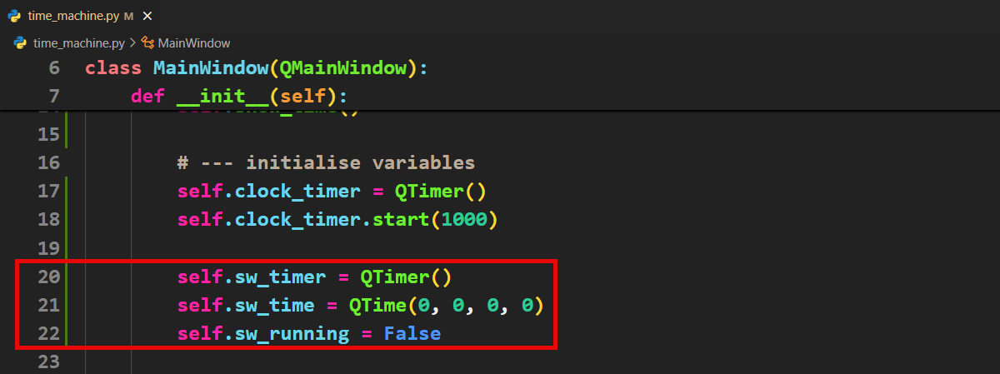
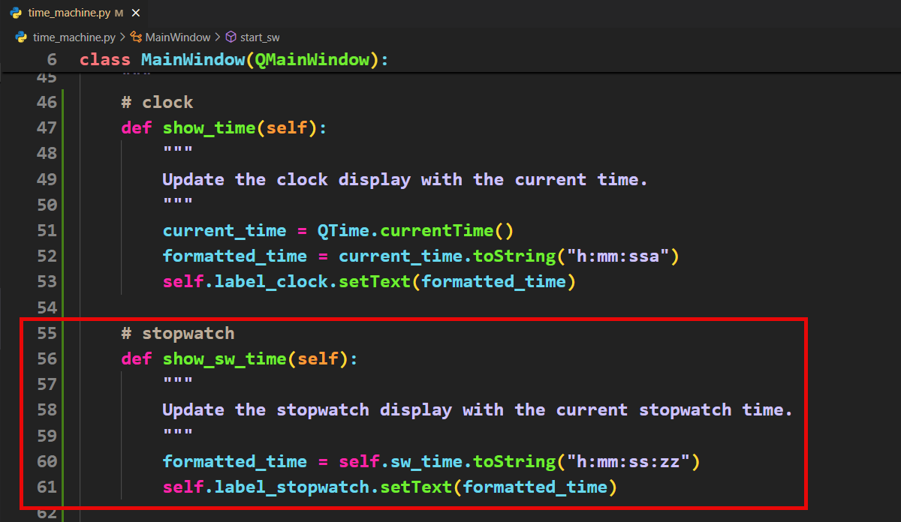
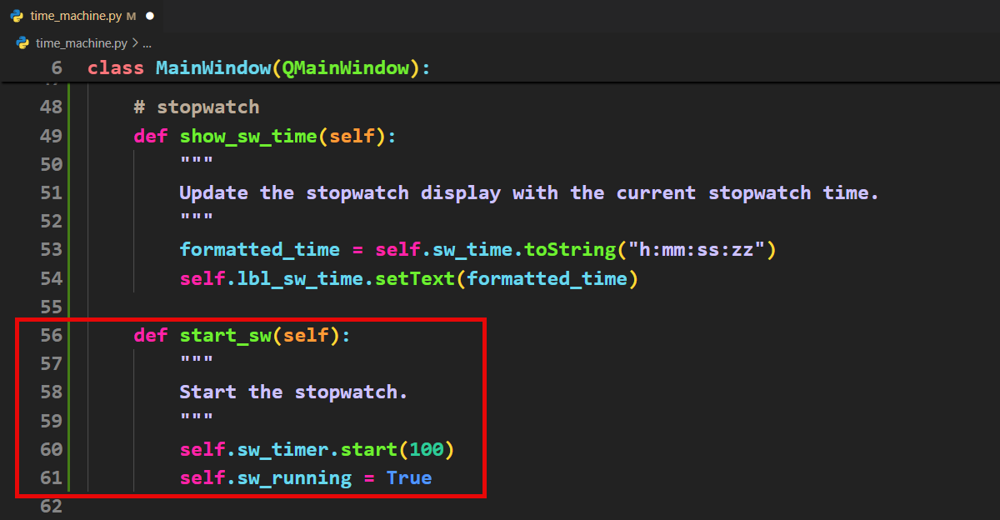
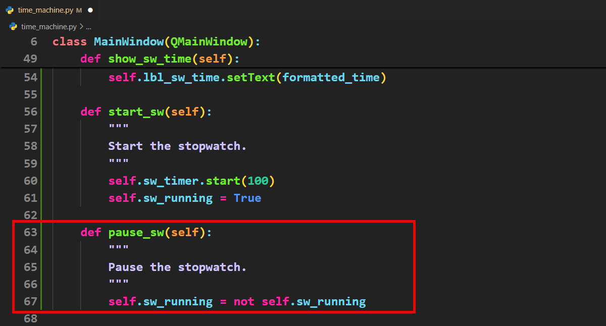
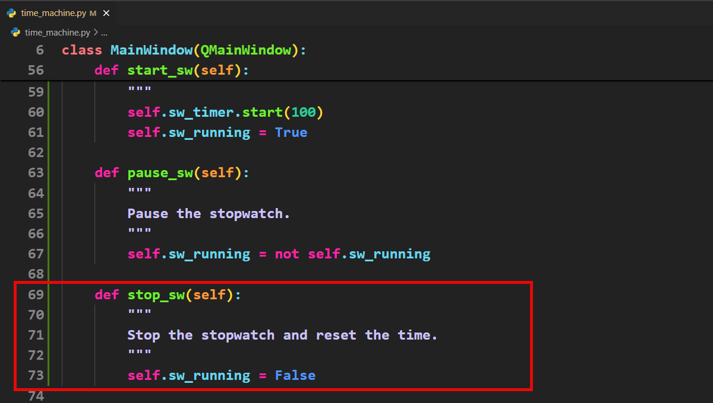
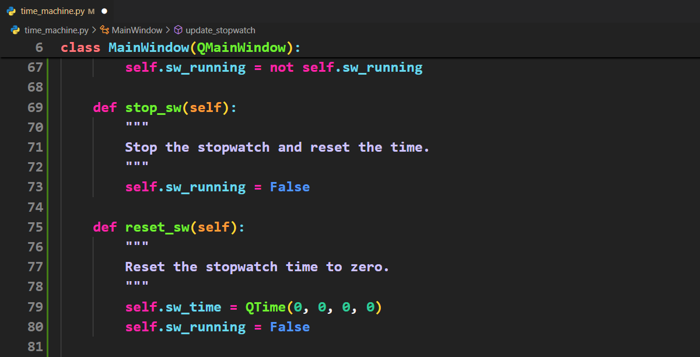
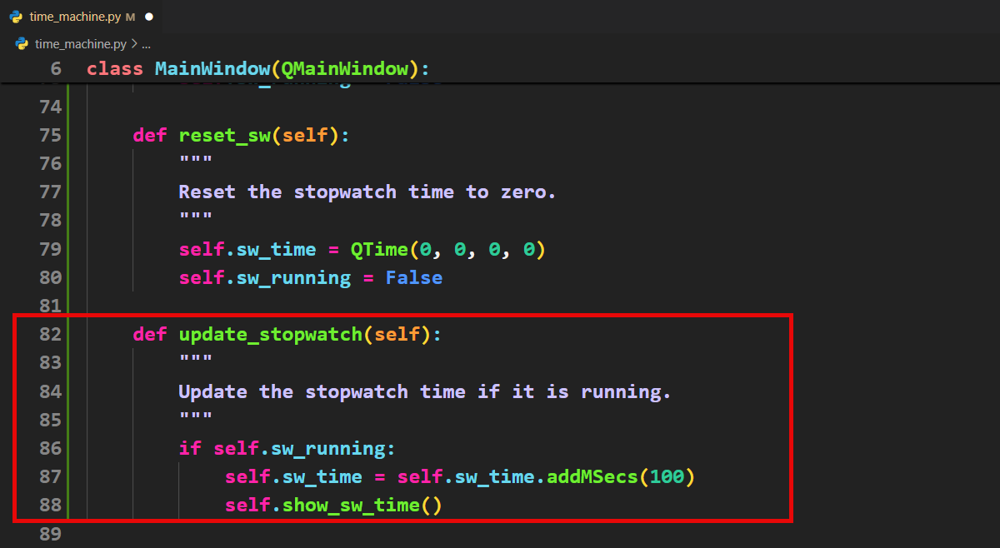
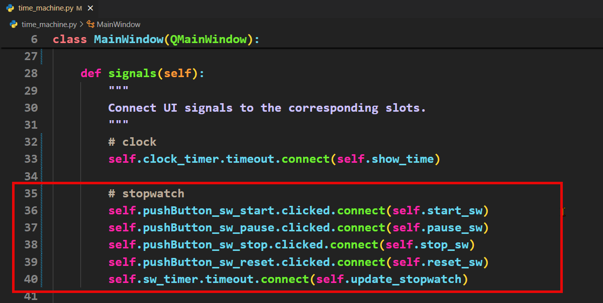
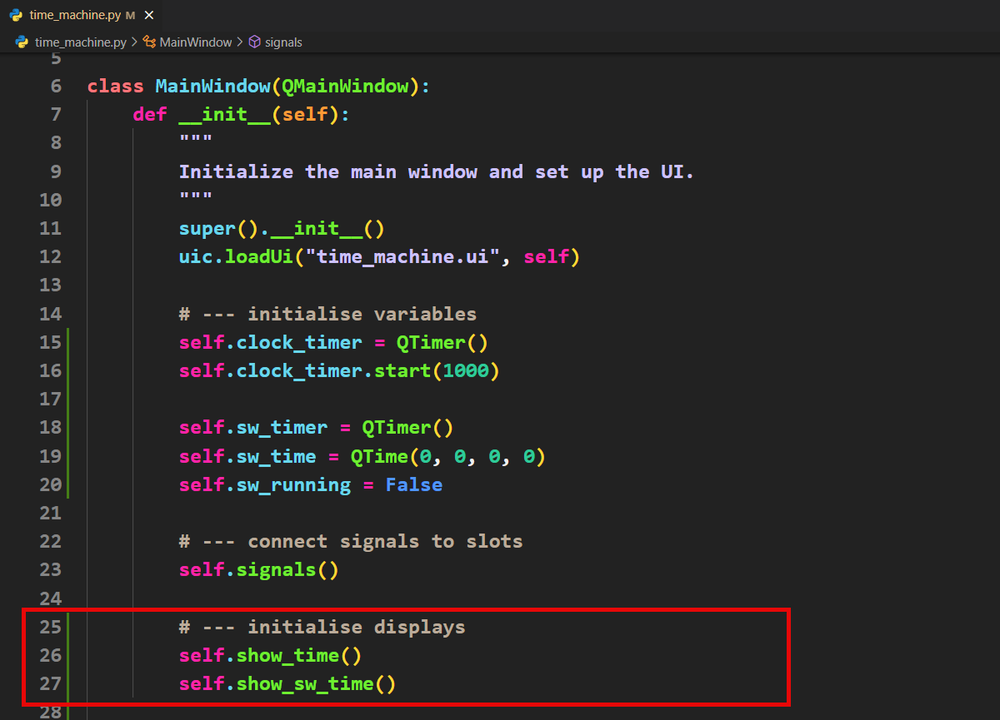

# Tutorial 11 - Stopwatch

```{admonition} In this tutorial you will:
- Plan and implement a user interface with Start, Stop, Pause, and Reset buttons, each managing the stopwatch's state.
- Utilise flag variables to track whether the stopwatch is running or paused, ensuring accurate control over its operation.
- Set up a timer that triggers every 100 milliseconds to update the stopwatch's time display, reflecting elapsed time accurately.
- Establish connections between user interactions (button presses) and corresponding functions to control the stopwatch's behaviour effectively.
```

Now to work on the next tab, the stopwatch. The stopwatch will also use a timer. Qt allows the running of numerous timers, so we can create a independent timer for the stopwatch. The big difference, is this time we are interested in the value of the timer.

## Stopwatch planning

For our stopwatch we have to consider actions for four buttons:

- Start button &rarr; starts the time going
- Stop button &rarr; stops the time going
- Pause button &rarr; stops the time if the time is going, or starts the time is the time is stopped.
- Reset button &rarr; returns the time to 0.

So our plan will to have a variable that stores the current stopwatch time value and a timer the triggers every 100ms. When the timer triggers and the stopwatch is going, add 100ms to the stopwatch time.

## Stopwatch code

Time to put those plans into action.

### Variables

1. Create the required stopwatch variables.



Lets look at this code a bit:

- **`self.sw_timer`** &rarr; the independent timer for the stopwatch
- **`self.sw_time`** &rarr; the current value for the stopwatch (currently 0 hours, 0 minutes, 0 seconds and 0 tenths of a second)
- **`self.sw_running`** a flag variable showing the state of the stopwatch (running or not running)

```{admonition} State machines
:class: hint
A state machine is a way to organize a program so it is in one specific state at a time, like `"waiting"`, `"running"`, or `"finished"`. The program moves between these states based on conditions or events, making it easier to manage complex tasks. Flag variables are often used to keep track of these states. 

A flag is a simple variable, typically set to `True` or `False`, to indicate whether something is happening or has finished. For example, a flag called `is_running` might be set to `True` when a process starts and `False` when it ends. State machines and flags help ensure the program behaves correctly by making decisions based on its current state.
```

### Slots

Before we can code the signals, we need slots to point the signals towards.

1. First we need to add the slot to display the stopwatch time.



2. Next the slot for the starting the stopwatch, which will set the timer to trigger every 100ms and sets the flag variable to `True`



3. Now the slot that pauses the stopwatch



This code is quite eloquent in that is simply reverses the current state of the flag variable (ie. `True` &rarr; `False` and `False` &rarr; `True`)

4. We need to add the stop stopwatch slot



5. The reset slot will stop the stopwatch from running and set the time back to the starting values.



6. Finally the slot for updating the stopwatch time. If the stopwatch is running, it will add 100ms and then refresh the display.



### Signals

Time to connect all our signals to slots:



### Initial value

Finally we want to stopwatch to display the initial value of 0:00:00:0. 

Previously we did a similar thing with `show_time` and placed it before the initialising the variables. Since `show_sw_time` uses the `sw_time` variable we place it before that variable is created.

To keep our code clean, we will create a new section at the bottom of the `__init__` and put both `show_time` and `show_sw_time` in it.



## Testing

Time to run your app and test that it works. 

Check:

- Is the initial stopwatch time `0:00:00:0`?
- Does the start button work?
- Does the pause button pause and unpause the time?
- Does the stop button work?
- Does the reset button work?
