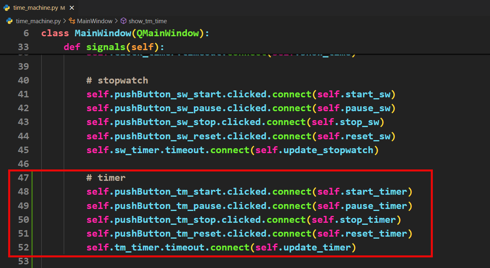

# Tutorial 12 - Timer

```{admonition} In this tutorial you will:
TBA
```

In this tutorial, we will finish the final tab of the Time Machine App, the Timer.

## Timer Planning

The major difference from the stopwatch, is the spinboxes used to set the starting time for the timer. So lets plan how we will deal with them.

If you recall, when we tested the UI, the values in the spinboxes automatically move up and down when you click on the buttons. We can use this built-in feature by getting the spinbox values and using them to create the starting time for the timer.

Once we have the the starting time, we can use the same processes we used for the stopwatch, only we subtract time rather than add.

The last thing we need to consider is what we do when the timer reaches 0. Two things will happen:

1. the timer needs to stop counting down
2. an alarm needs to sound

## Timer Coding

### Adding variables

We will add the same types of variable as we did for the stop watch. This time we only worry about the hours, minutes and seconds.


### Slots Code

Now to add the slots that we can connect the signals to.

1. The slot to show the timer time


Before we can create the start timer slot, we need a method that converts the values in the spin box to a time. 

2. This method isn't a slot, so we will place it in a new section under the slots section.


3. Now we can add the start timer slot


4. We can now add the slots for the remaining buttons, which are the same as the stopwatch slots.


5. Now we need the slot that will update the time if the timer is going, as well as stop the timer if time reaches 0.


### Signals Code

Now to connect all the signals to their relevant slots.



### Initial time

The final step is to change the initial time displayed for the timer.


## Testing

Time to check that our timer works. Make sure all the buttons do what you want them to do, and check that it stops counting when time reaches 0.

## Alarm Code

Most timers have alarms that sound when the time reaches 0. We will add that feature to our timer as well.

### Import modules

Qt has modules to handle sounds. We will use the `QSoundEffect` from the `QtMultimedia` library, but we will need to import it first.

We are also going to use **[this sound effect](./assets/img/14/alarm_sound.wav)**. Click on the link to download it and then move it to the same folder as your `time_machine.py` file.

In order for Qt to use this file we also need to import `QUrl` from the `QtCore` library. So your import section should look like this.


### Variables

We need to create some new variables to use with the sound.


### Playing sound effect

We then need to play the sound effect when timer gets to 0. We already check if the time is 0 in `update_timer` so this is the logical place to put the alarm.


## Test Alarm

Launch you app and see if the alarm sounds when the time reaches 0.