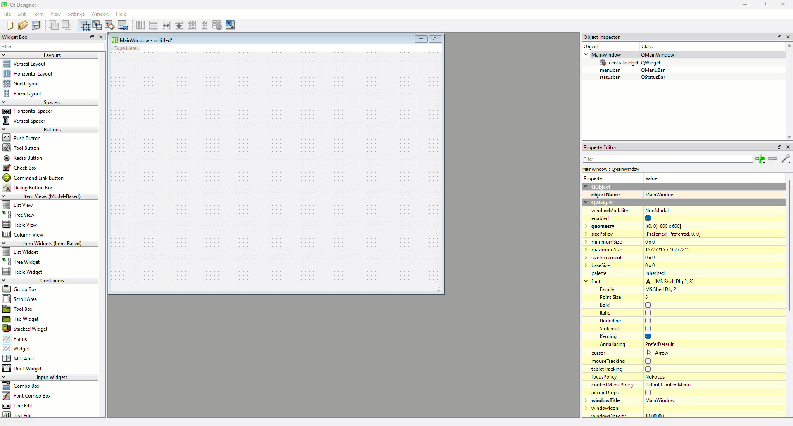
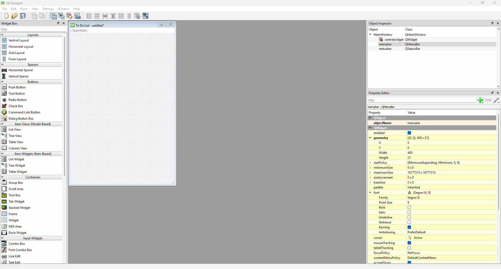
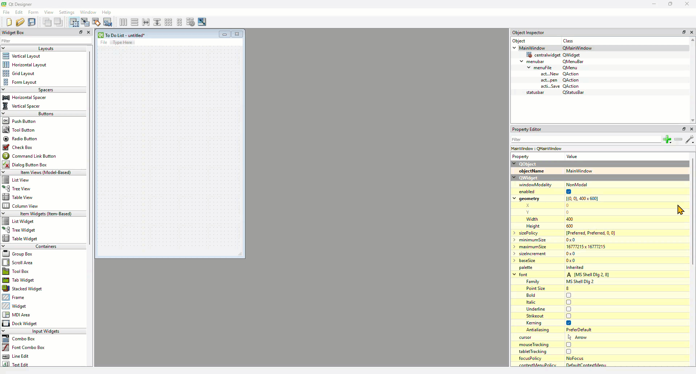
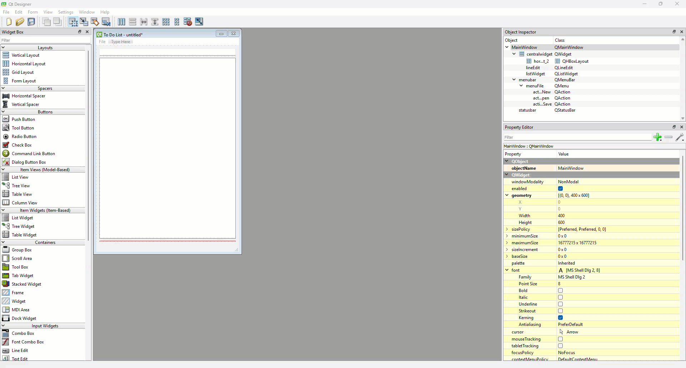
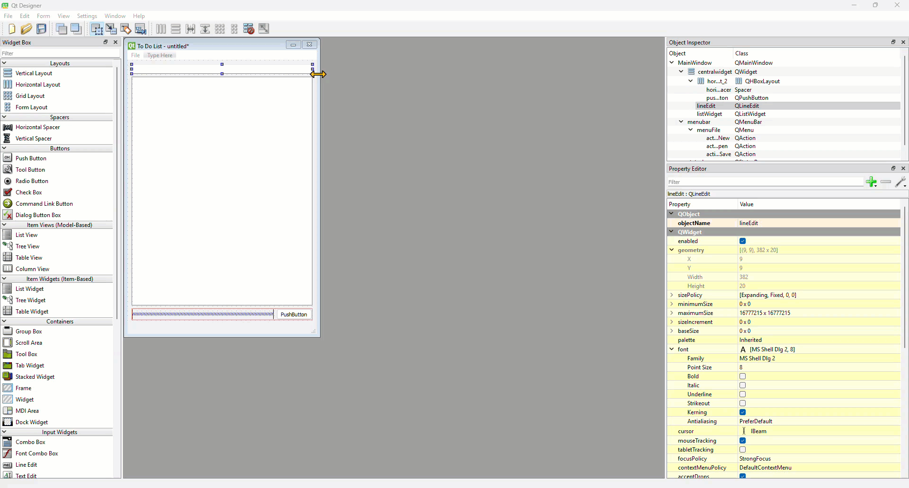
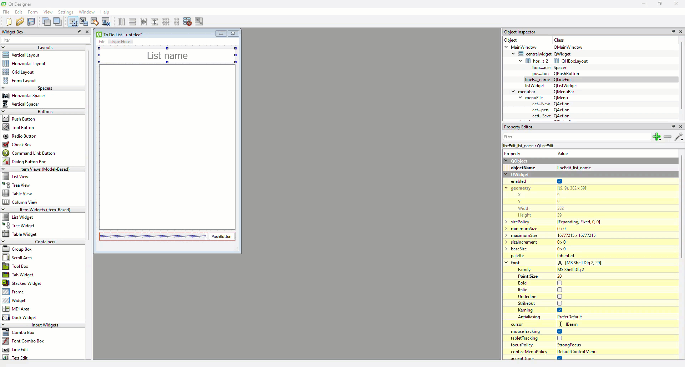
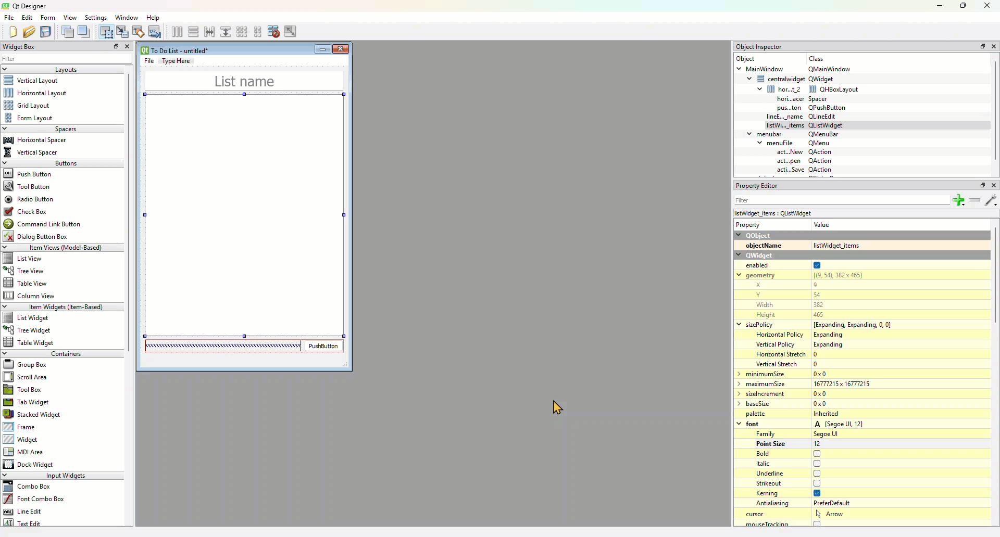

# Tutorial 13 - To Do List UI

```{admonition} In this tutorial you will:
TBA
```

The next app that we will create is a To Do List. Through this you will learn to use Qt's menu system, Line Edit, List widgets and Dialogue Boxes. 

Before we get into the code, we need to create the UI in QT Designer.

## Window Settings

1. Create a new main window in QT Designer
2. Change the geometry:
   - **Width** &rarr; **400**
   - **Height** &rarr; **600**
3. Change the **windowtitle** &rarr; **To Do List**



## Menu

1. Click on the Menu **Type Here**
2. Type **File** and then return / enter
3. Click on the first **Type Here** in the new File menu
4. Type **New** and then return / enter
5. Click on the next **Type Here** in the new File menu
6. Type **Open** and then return / enter
7. Click on the next **Type Here** in the new File menu
8. Type **Save** and then return / enter



## Workspace

### Add Components

1. Find the **Line Edit** widget and drag it onto the window canvas
2. Find the **List Widget** (not the List View) and drag it below the **Line Edit**
3. Drag the **Horizontal Layout** below the **List Widget**
4. Right click on the window canvas &rarr; **Lay out** &rarr; **Lay Out Vertically**



5. Use the **Object Inspector** to place a **Push Button** in the **Horizontal Layout**
6. Then drag a **Horizontal Spacer** to the left of the **Push Button**



### Component Properties

1. Select the **QLineEdit** widget
2. Change the **objectName** &rarr; **lineEdit_list_name**
3. Change the font **Point Size** &rarr; **20**
4. Change the alignment **Horizontal** &rarr; **AlignHCenter**
5. Make **placeholderText** &rarr; List name



6. Select the **QListWidget** widget
7. Change the **objectName** &rarr; **listWidget_items**
8. Change the font **Point Size** &rarr; **12**



9. Select the **QPushButton** widget
10. Change the **objectName** &rarr; **pushButton_add**
11. Change sizePolicy **Horizontal Policy** &rarr; **MinimumExpanding**
12. Change the font **Point Size** &rarr; **12**
13. Change **text** &rarr; **Add item**



## Test and Save

Preview the UI using **Ctrl/Command + R**.

If all is as expected, save the file into your repo as **to_do_list.ui**
