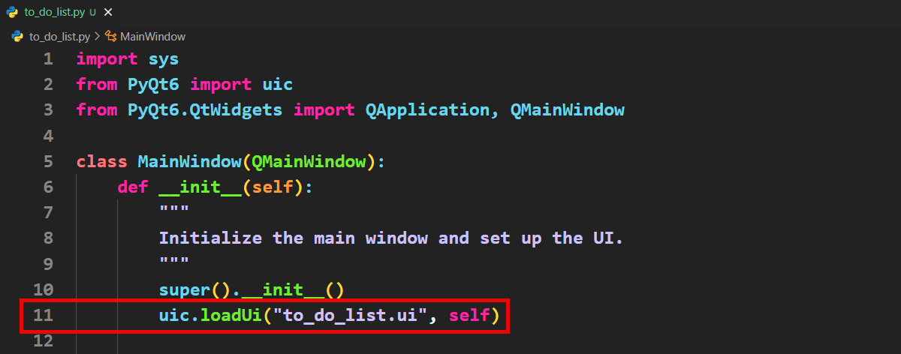
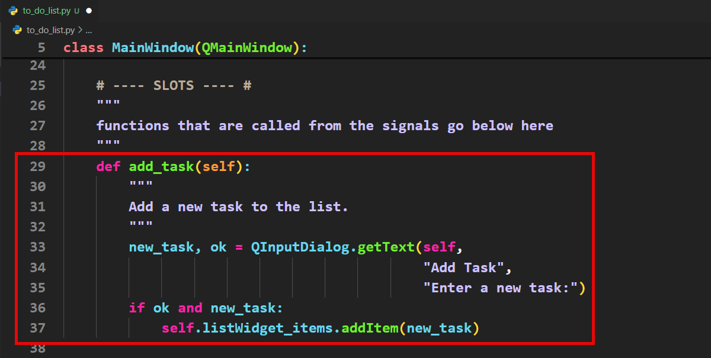
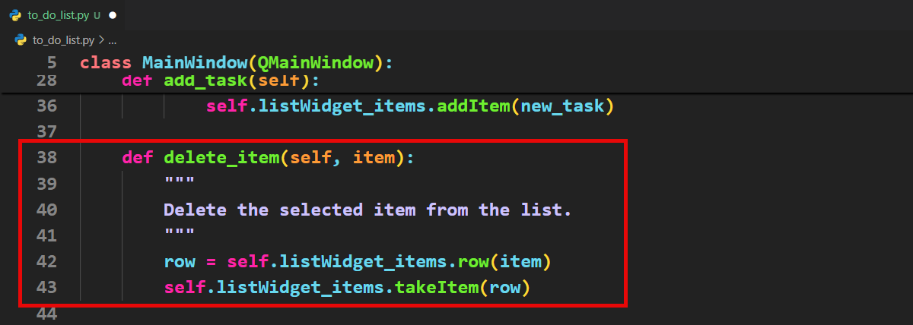
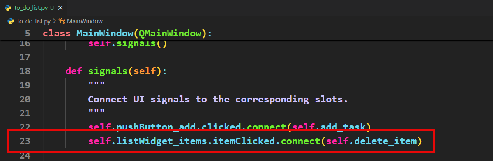

# Tutorial 14 - Basic To Do

```{admonition} In this tutorial, you will:
- Utilise a QLineEdit widget to set and display the to-do list's title.
- Implement a QPushButton that, when clicked, opens an input dialog box for entering new tasks.
- Use a QListWidget to show all added tasks, ensuring they are visible and organised.
- Enable item removal from the list by connecting the QListWidget's itemClicked signal to a function that deletes the selected task.
```

In this tutorial we will implement the basic features of our To Do App:

- Naming the to do list
- Adding items to the to do list
- Display all the items on the list
- Removing items from the to do list

## Basic To Do Planning

How can we achieve the objective above?

Naming the list is already taken care of since the user can type in the QLineEdit widget. So we only have to plan the implementation of adding and subtracting items.

We are going to use the **QWidgetList** as the data structure for storing our tasks.

We will use the **pushButton_add** to add items. It will launch a Input Dialogue Box where the user can type in their new item. The item will then be added to our list.

```{admonition} Dialog Boxes
:class: hint
Qt dialogue boxes are special pop-up windows that let your program talk to the user or ask them for input. For example, you can use a message box to show a warning, a file dialog to let the user open or save files, or an input box to ask for their name. These boxes are ready-made by Qt, so you don’t have to design them yourself—they just work with a few lines of code!

We will be using some of the dialog boxes. To explore the rest of them, go to the **[Qt documentation](https://doc.qt.io/qt-6/dialogs.html)**.
```

The **listWidget** has a signal for when an item is clicked. We can use this to delete items from our list.

## Basic To Do Code

To start:
1. copy your new boilerplate
2. rename it `to_do_app.py`
3. then change the `loadUi` file &rarr; `to_do_list.ui`



This code is going to be a little more complicated, so we are going to change our coding process. Rather then adding all the slots then the signals, we will work with slot/signal pairs. That way we can test that each slot/signal pair works.

### Variables

We will not be using any variables for this app. Rather we will be storing all the data in the UI components.

### Add item button

The first slot/signal pair that we are going code is for the **Add item** button

1. The the **Slots section** add the following code.



```{admonition} Tuple Unpacking
When a function returns a tuple&mdash;eg. `(356, 892)`&mdash;Python allows you to unpack those values straight into variables. `line 33` is an example of this.

The **QInputDialog** returns two values in a tuple:
- The content of the **QInputDialog** text box
- A boolean indicating if the **Ok** button was clicked.

In `line 33` we unpacked those two values straight into two variables&mdash;`new_task` and `ok`. This means that we can work with both independently.
```

Notice this code will write the `new_task` into the `listWidget_items` only if:

- a value was entered into the dialog box
- the user clicks the ok button (rather than cancel)

2. Now add connect the **pushButton_add** signal to the **add_task** slot.


Now lets test your app an make sure that it acts as expected.

- The **Add item** button launches a **Input Dialog**
- Entering a value in the **Input Dialog** and clicking **Ok** add a task to the Item Widget
- Clicking **Ok** with no value in the **Input Dialog** does not add a task to the Item Widget
- Clicking **Cancel** on the **Input Dialog** does not add a task to the Item Widget

### Click item

The **itemWidget** has a signal for when the user clicks it. We will use this signal to remove and item from our task list. In addition when this signal is triggered, it passes the **item** clicked. From the **item** we extract its row number, which is the information needed to delete it from the list.

1. In the slot section enter the following code.



2. We now need to connect this slot to its signal



Test your app. Make sure that clicking on an item removes it from your list.
