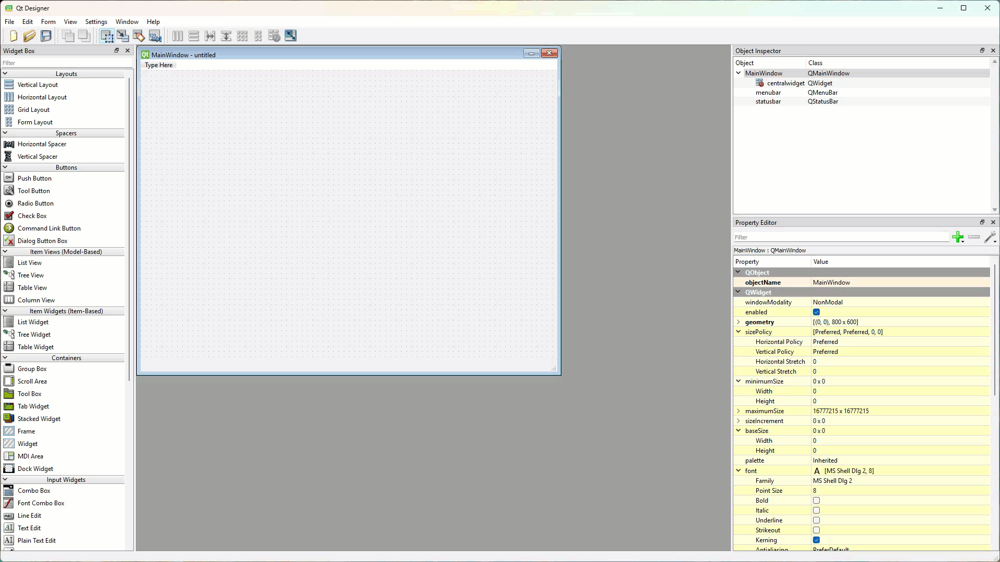
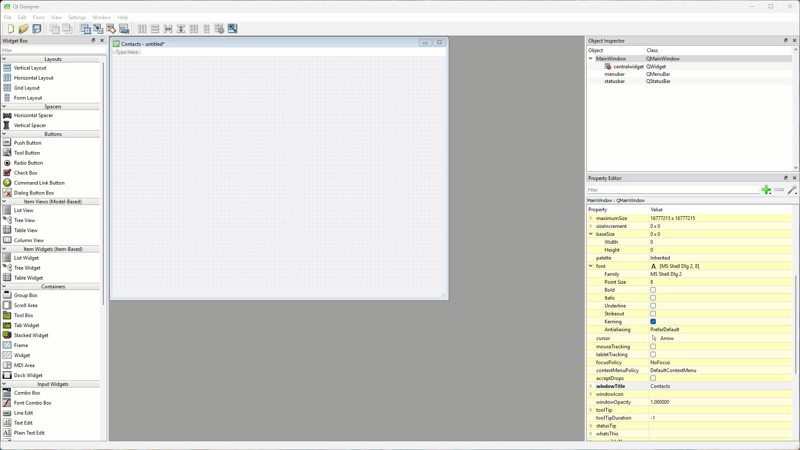
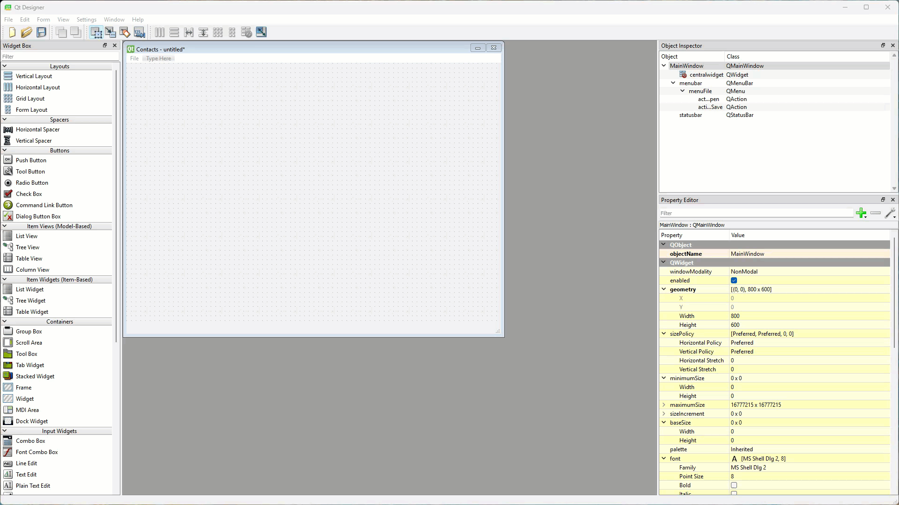
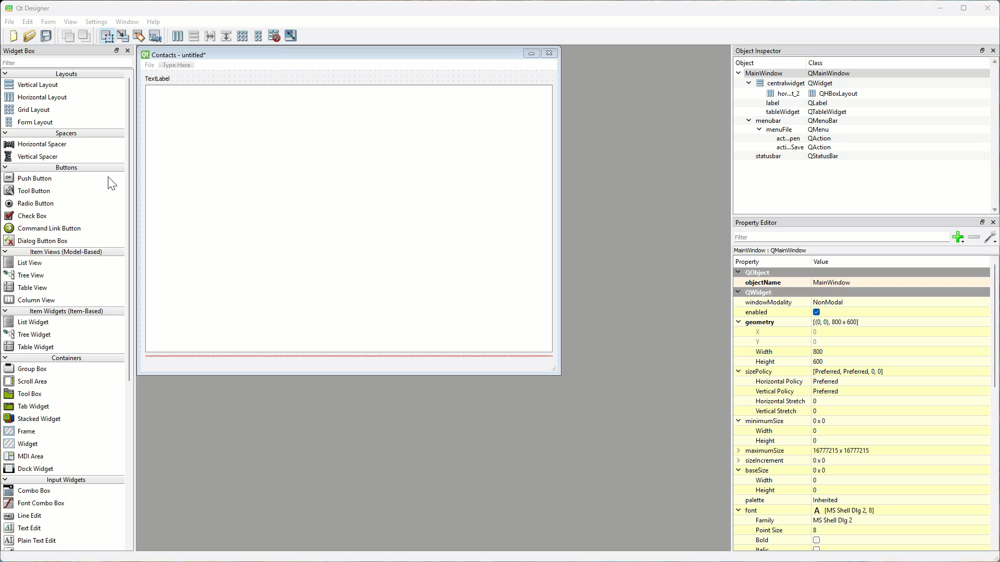
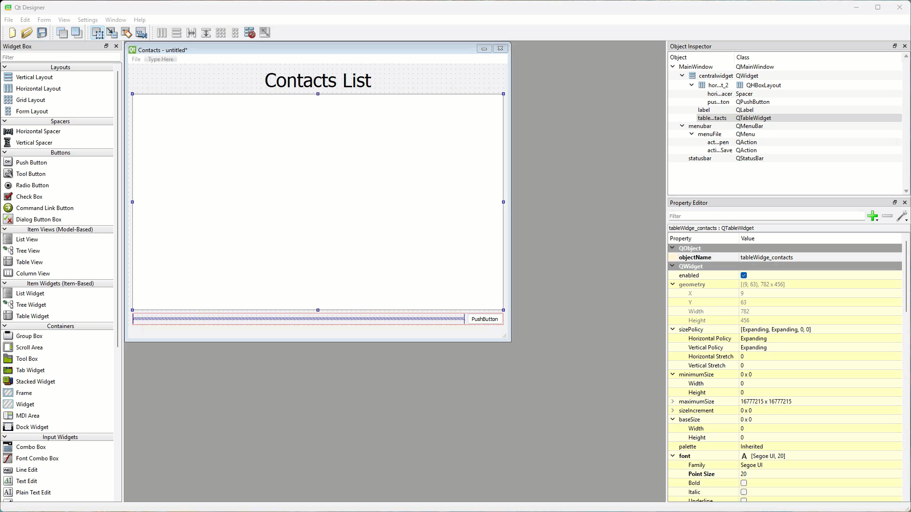
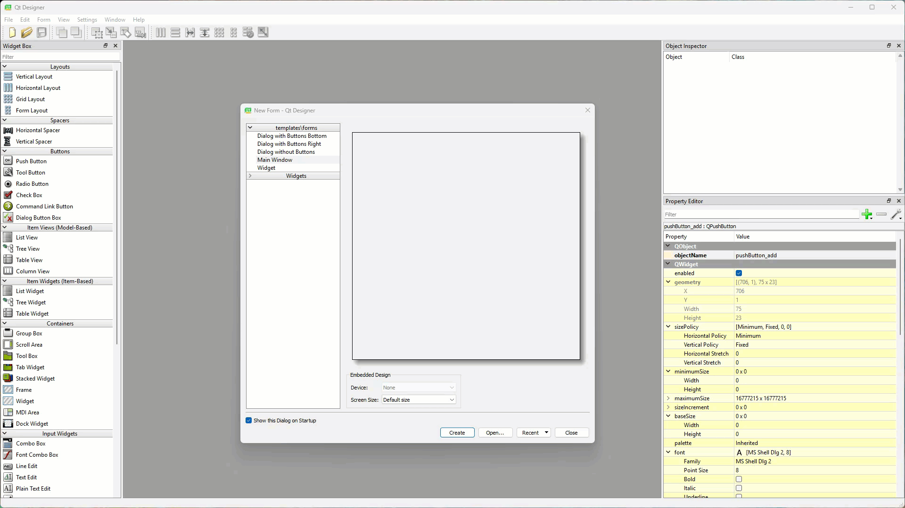
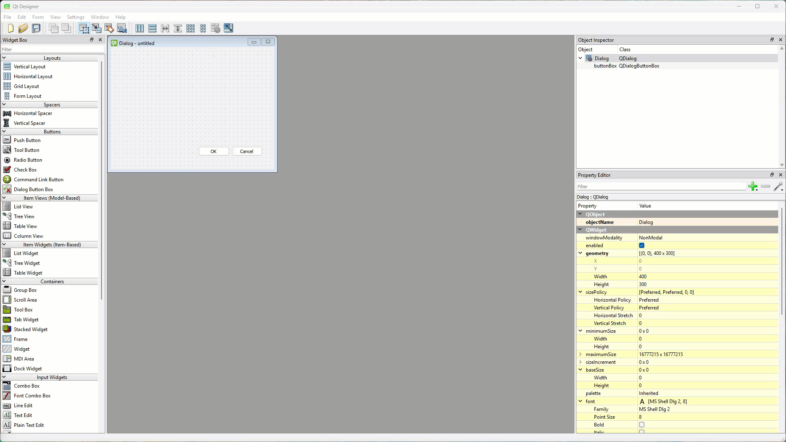
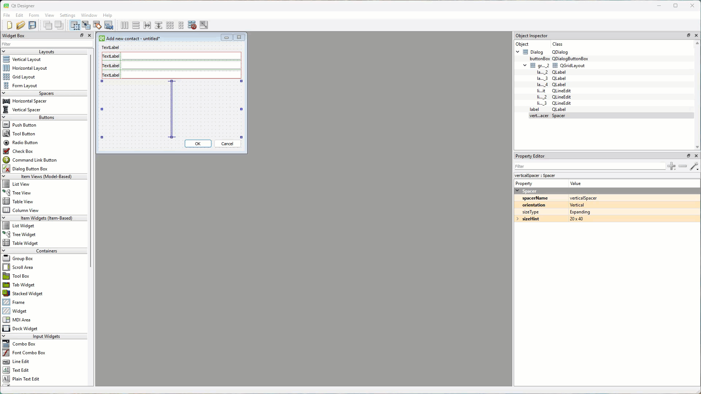
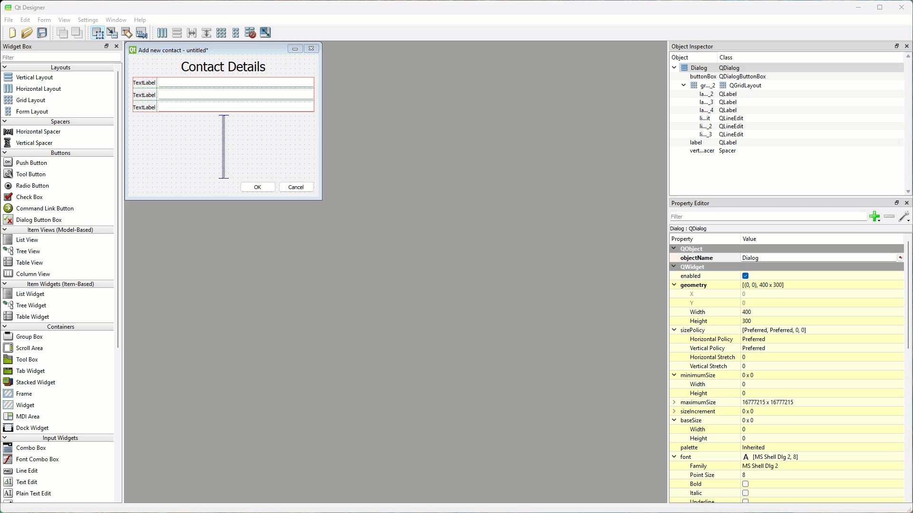
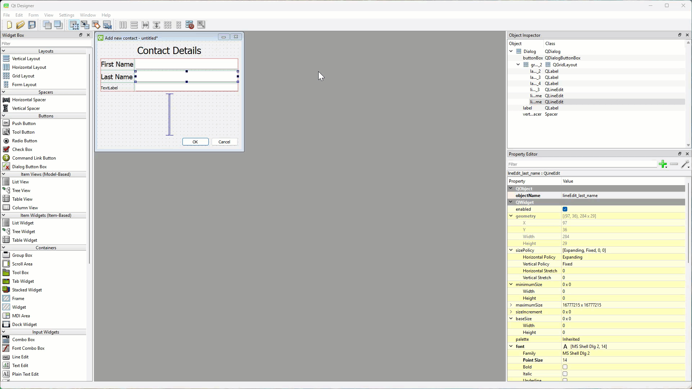

# Tutorial 16 - Contacts UI

```{admonition} In this tutorial, you will:
TBA
```

Default dialog boxes, like the one we using in our To Do app, are helpful but can be restricting. Sometimes you want dialog boxes that serve very specific purposes. Fortunately Qt allows you to design custom dialog boxes. We will explore creating custom dialog boxes use  through developing a contact list app. We will also look at displaying tabular data and work with csv files.

```{admonition} CSV files
:class: hint
CSV (Comma-Separated Valus) files are simple text files used to store data in a table format, where each line represents a row, and each value in the row is separated by a comma. They are commonly used to transfer data over the internet because they are easy to create, read, and understand, even without special software. For example, a CSV file might contain a list of students with columns for their names, ages, and grades. 

Since they're plain text, CSV files can be shared between different applications and systems, making them useful for exchanging data, such as between websites, databases, or data analysis tools. They're compatible with most software and programming languages, making them a popular choice for transferring information.
```

We will use QT Designer to create two UIs for this app:

1. MainWindow
2. ContactDetailsDialog

## MainWindow

### Window Settings

1. Create a new main window in QT Designer
2. Window geometry remains:
   - **Width** &rarr; **800**
   - **Height** &rarr; **600**
3. Change the **windowTitle** &rarr; **Contacts**



### Menu

1. Double-click on the Menu **Type Here**
2. Type **File** and then return / enter
3. Double-click on the first **Type Here** in the new File menu
4. Type **Open** and then return / enter
5. Double-click on the next **Type Here** in the new File menu
6. Type **Save** and then return / enter



### Initial Layout

1. Click and drag a **Label** onto the canvas
2. Add a **Table Widget** (note: not the Table View) under the **Label**
3. Add the **Horizontal Layout** under the Table Widget
4. Right click on the window canvas &rarr; **Lay out** &rarr; **Lay Out Vertically**



5. Use the **Object Inspector** to place a **Push Button** in the **Horizontal Layout**
6. Then drag a **Horizontal Spacer** to the left of the **Push Button**



### Label Settings

1. Change the Label text &rarr; **Contacts List**
2. Change font **Point Size** &rarr; **30**
3. Change alignment **Horizontal** &rarr; **AlignHCenter**


### Table Widget Settings

1. Change the **objectName** &rarr; **tableWidget_contacts**
2. Change font **Point Size** &rarr; **20**


### Button Settings

1. Change the text on the **pushButton** &rarr; **Add**
2. Change the **objectName** &rarr; **pushButton_add**



### Save MainWindow

Preview the **MainWindow** then save it to your repository, calling it **contacts.ui**

Then close it.

## ContactDetailsDialog

Now we will create the Dialogue Box that we will use to add new contact to our list. We will use the Dialogue box to enter the contacts first name, last name and phone number.

In the New Form Dialogue:

1. Choose **Dialogue with Buttons Bottom**
2. The click **Create**



### Initial Layout

1. Window geometry remains:
   - **Width** &rarr; **400**
   - **Height** &rarr; **300**
2. Change the **windowTitle** &rarr; **Add new contact**
3. Click and drag a **Label** onto the canvas
4. Add a **Grid Layout** under the **Label**
5. Into the **Grid Layout** add 3 Labels with a paired **Line Edit**
6. Right click on the window canvas &rarr; **Lay out** &rarr; **Lay Out Vertically**
7. Finally add a **Vertical Spacer** to the under the **Grid Layout**



### Title Settings

1. Change the top Label text &rarr; **Contact Details**
2. Change font **Point Size** &rarr; **20**
3. Change alignment **Horizontal** &rarr; **AlignHCenter**



### First Name Settings

The first row of the **Grid Layout** will deal with the contact's first name.

1. Settings for the **Label** 
   - text &rarr; **First Name**
   - font **Point Size** &rarr; **14**
2. Settings for the **Line Edit**
   - **objectName** &rarr; **lineEdit_first_name**
   - font **Point Size** &rarr; **14**



### Last Name Settings

The second row of the **Grid Layout** will deal with the contact's last name.

1. Settings for the **Label** 
   - text &rarr; **Last Name**
   - font **Point Size** &rarr; **14**
2. Settings for the **Line Edit**
   - **objectName** &rarr; **lineEdit_last_name**
   - font **Point Size** &rarr; **14**


### Phone Number Settings

The last row of the Grid Layout is for the contact's phone number.

1. Settings for the **Label** 
   - text &rarr; **Phone Number**
   - font **Point Size** &rarr; **14**
2. Settings for the **Line Edit**
   - **objectName** &rarr; **lineEdit_phone_number**
   - font **Point Size** &rarr; **14**



### Dialog Buttons

We don't have to do anything for the **Ok** and **Cancel** buttons, as these are built into the dialog box.

### Test and Save

Preview the **ContactDetailsDialog** then save it to your repository, calling it **new_contact.ui**

Then close it.
