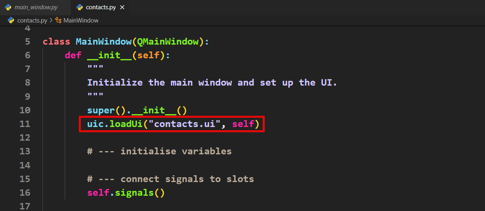

# Tutorial 17 - Contact App

```{admonition} In this tutorial, you will:
TBA
```

## New file

First, we need to setup your new file:

1. Copy your new **main_window.py** file, calling it **contacts.py**.
2. Change the file name to **contacts.ui**

 

3. Run the code to ensure the window loads.

[Contacts csv file](./assets/img/19/contacts.csv)